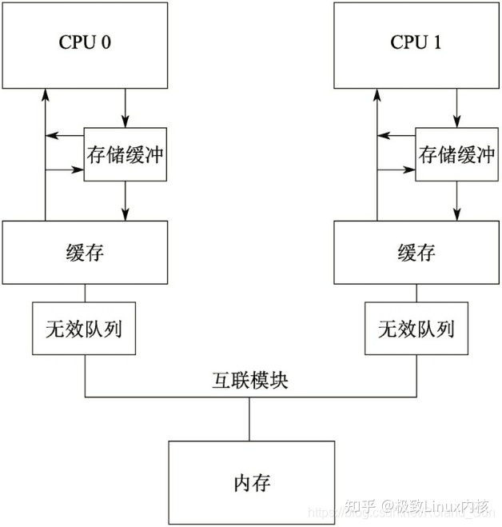
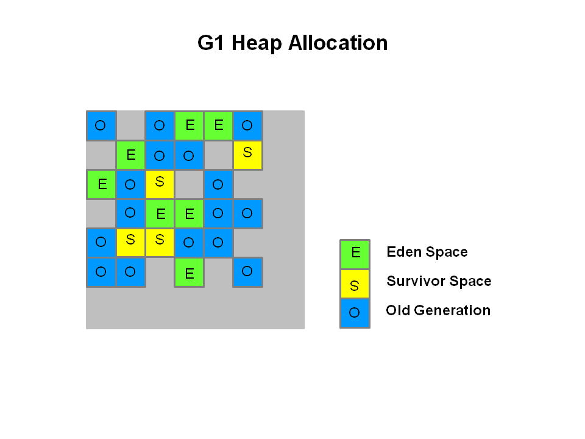
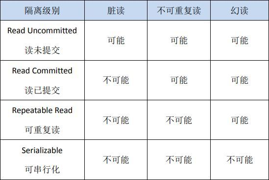

# 面试总结
https://r2coding.com/#/README?id=%e8%ae%a1%e7%ae%97%e6%9c%ba%e7%bd%91%e7%bb%9c


# 算法
## 冒泡排序
请将数组a日 进行从小到大推序，假设 a[2.4,5.10,-1,-4](不能内置或框架方法)

```java
public class 冒泡排序 {
    public static void main(String[] args) {
        double[] doubleArr = new double[]{2.4, 5.10, -1, -4};
        double[] sort = sort(doubleArr);
        System.out.println("end = " + Arrays.toString(sort));
    }

    public static double[] sort(double[] inputArr) {
        // 最外层遍历
        // 在i+1的地方，进行内层的遍历，如果i比i+1大，那么交换位置，小的保持在前面
        if (Objects.isNull(inputArr) || inputArr.length <= 1) {
            return inputArr;
        }
        for (int i = 0; i < inputArr.length; i++) {
            for (int j = i + 1; j < inputArr.length; j++) {
                double tempI = inputArr[i];
                double tempJ = inputArr[j];
                if (tempI > tempJ) {
                    inputArr[j] = tempI;
                    inputArr[i] = tempJ;
                }
            }
        }
        return inputArr;
    }

    public static double[] sortV2(double[] inputArr) {
        // 最外层遍历
        // 在i+1的地方，进行内层的遍历，如果i比i+1大，那么交换位置，小的保持在前面
        if (Objects.isNull(inputArr) || inputArr.length <= 1) {
            return inputArr;
        }
        for (int i = 0; i < inputArr.length - 1; i++) {
            for (int j = i + 1; j < inputArr.length - i - 1; j++) {
                double tempI = inputArr[i];
                double tempJ = inputArr[j];
                if (tempI > tempJ) {
                    inputArr[j] = tempI;
                    inputArr[i] = tempJ;
                }
            }
        }
        return inputArr;
    }

}
```


## 遍历二叉树
普通的遍历二叉树
普通的递归进行遍历二叉树
也可以，使用栈，进行遍历二叉树

## 大数据量的情况下遍历二叉树
假设上述二叉树有1亿个节点，试写出不会宕机的遍历方案

## 1G的数据，100M内存，如何找到 Top10

## 场景题：100片药A，100片药B，每天必须吃一片A和一片B，怎么活下来？

## 知道什么查找算法？

## 求TopK问题能用什么解决方法？

## 除了堆排序还能用什么方法来解决？


# 计算机网络基础
## 什么是TCP/IP协议？TCP/IP协议的特点是什么？

## tcp四次挥手过程？为什么等待2MSL？
MSL是Maximum Segment Lifetime英文的缩写，中文可以译为“报文最大生存时间”，他是任何报文在网络上存在的最长时间，超过这个时间报文将被丢弃。

## 为什么连接的时候是三次握手，关闭的时候却是四次握手？
1）第一次握手：建立连接时，客户端A发送SYN包（SYN=j）到服务器B，并进入SYN_SEND状态，等待服务器B确认。
（2）第二次握手：服务器B收到SYN包，必须确认客户A的SYN（ACK=j+1），同时自己也发送一个SYN包（SYN=k），即SYN+ACK包，此时服务器B进入SYN_RECV状态。
（3）第三次握手：客户端A收到服务器B的SYN＋ACK包，向服务器B发送确认包ACK（ACK=k+1），此包发送完毕，客户端A和服务器B进入ESTABLISHED状态，完成三次握手。

TCP的连接的拆除需要发送四个包，因此称为四次挥手(four-way handshake)。客户端或服务器均可主动发起挥手动作，在socket编程中，任何一方执行close()操作即可产生挥手操作。

1，当主机甲确认发送完数据且知道乙已经接受完了，想要关闭发送数据口（当然确认信号还是可以发），就会发FIN给主机B.

2，主机乙收到甲发送的FIN，表示收到了，就会发送ACK回复。

3，但这是乙可能还在发送数据，没有想要关闭数据口的意思，所以FIN与ACK不是同时发送的，而是等到乙数据发送完了，才会发送FIN给主机A.

4，A收到B发来的FIN，知道B的数据也发送完了，回复ACK，A等待2MSL以后，没有收到B传来的任何消息，知道B已经收到自己的ACK了，A就关闭链接，B也关闭链接了。

## 什么是HTTP协议？HTTP协议的特点是什么？
HTTP 是一个属于应用层的面向对象的协议，HTTP 协议一共有五大特点：1、支持客户/服务器模式；2、简单快速；3、灵活；4、无连接；5、无状态。
http，是一种请求/响应模式的协议。
无连接：服务器收到了客户端的请求之后，响应完成并收到客户端的应答之后，即断开连接。限制每次的连接只处理一次请求。从而节省传输时间。

1989年，由蒂姆·伯纳斯 发起
1991年，发布HTTP/0.9，这是HTTP 协议的第一个版本，也是最简单的版本，只支持一个GET 方法，并且只能传输简单的文本字符串。
1996年，发布HTTP/1.0，其内容大大增加，可传输图像，视频，二进制格式等丰富的网页。支持GET，POST，HEAD 三种方法，增加了HTTP Header头信息，状态码，内容编码等功能。
1997年，发布HTTP1.1，是较为完整的版本。在之前的基础上，其主要引入了持久连接，分块传输等功能。另外，增加了OPTIONS、PUT、PATCH、DELETE、TRACE 和 CONNECT方法。对于客户端，引入了重要的Host 头部字段，用来指定服务器的域名，使得一个请求可以发往同一台服务器上的不同网站，为虚拟主机的流行打下基础。

## http请求/响应的步骤是什么？
 1、客户端连接到web服务器：客户端，我们通常指的是浏览器，与web服务器的http端口（默认情况下80）建立一个TCP套接字的连接。
 2、发送HTTP请求：通过TCp套接字，浏览器向web服务器发送一个请求报文，一个请求报文包括请求行、请求头、空行、请求体四部分。
 3、服务器端解析请求并返回http响应：web服务器解析请求，定位资源，返回响应报文。响应报文主要包括状态行、响应头部、空行、响应体四部分构成。
 4、释放TCP连接：web浏览器主动关闭TCP套接字，关闭TCP连接。而客户端则需要被动的关闭TCP套接字，释放TCP连接。
 5、客户端浏览器解析响应报文，解析成HTML内容，经过浏览器的渲染之后就能展示给人们了。

## 什么是HTTPS协议？HTTPS协议的特点是什么？
HTTPS是HTTP协议的安全版本，HTTP协议的数据传输是明文的，是不安全的，HTTPS使用了SSL/TLS协议进行了加密处理。

## HTTPS和HTTP的区别？连接建立的过程？
1. HTTP 信息是明文传输，存在安全风险的问题；HTTPS 在 TCP 和 HTTP 网络层之间加入了 SSL/TLS 安全协议，使得报文能够加密传输。
2. HTTP 连接建立相对简单， TCP 三次握手之后便可进行 HTTP 的报文传输；而 HTTPS 在 TCP 三次握手之后，还需进行 SSL/TLS 的握手过程，才可进入加密报文传输。
3. HTTP 的端口号是 80，HTTPS 的端口号是 443。
4. HTTPS 协议需要向 CA（证书权威机构）申请数字证书，来保证服务器的身份是可信的。

通过混合加密的方式可以保证信息的机密性，解决了窃听的风险。HTTPS 采用的是对称加密和非对称加密结合的「混合加密」方式：
在通信建立前采用非对称加密的方式交换「会话秘钥」，后续就不再使用非对称加密。
在通信过程中全部采用对称加密的「会话秘钥」的方式加密明文数据。

## 什么是DNS协议？DNS协议的特点是什么？


## 输入url到页面加载完中间的流程？

## cookie和session

## session的过期时间设置的多少
spring-session，redis，session共享

## 为什么使用cookie会导致csrf攻击？
浏览器会依据加载的域名附带上对应域名cookie。

就是如果用户在a网站登录且生成了授权的cookies，然后访问b网站，b站故意构造请求a站的请求，如删除操作之类的，用script，img或者iframe之类的加载a站着个地址，浏览器会附带上a站此登录用户的授权cookie信息，这样就构成crsf，会删除掉当前用户的数据。

## 为什么使用jwt能避免csrf攻击呢？
CSRF攻击之所以能够成功，是因为服务器误把攻击者发送的请求当成了用户自己的请求。那么我们可以要求所有的用户请求都携带一个CSRF攻击者无法获取到的Token ）

## token被盗取怎么办
a、在存储的时候把 token 进行对称加密存储，用时解开。
b、将请求 URL、时间戳、token 三者进行合并加盐签名，服务端校验有效性。
c、HTTPS 对 URL 进行判断。

## 为什么使用jwt能避免xss攻击呢？
jwt是无状态的，不会在客户端存储任何信息，所以不会被xss攻击。

## jwt存储在localstorage中，会被xss攻击吗？
会，因为localstorage是可以被xss攻击的。

## 如何防止xss攻击？
1、对用户输入的内容进行转义，防止xss攻击。
2、对用户输入的内容进行过滤，防止xss攻击。
3、对用户输入的内容进行校验，防止xss攻击。
4、对用户输入的内容进行编码，防止xss攻击。
总之就是前端需要保证用户输入的内容是安全的。

## 在goole域名中查看baidu域名的cookie能查看到吗？

## TCP 底层是怎么实现的，如果让你用 Java 模拟 TCP 的过程，做一个仿真，你有什么想法。
大学学习计网的时候，协议栈之类的了解过吗（这部分我都不懂，认栽了）

## 输入ping命令之后会发生什么？

## ping不通的话浏览器能访问到吗？
当我们使用 ping www.csdn.net时，ping程序就会向www.csdn.net的Web网址的主服务器发送一个32字节的消息，然后，它将服务器的响应时间记录下来。
Ping程序将会向用户显示4次测试的结果。响应时间低于300毫秒都可以认为是正常的，时间超过400毫秒则较慢。
出现“请求暂停（Request time out）”信息意味着网址没有在1秒内响应，这表明

1、服务器没有对Ping做出响应的配置或者网址反应极慢。如果你看到4个“请求暂停”信息，说明网址拒绝Ping请求。因为过多的Ping测试本身会产生瓶颈，因此，许多Web管理员不让服务器接受此测试。
2、如果网址很忙或者出于其他原因运行速度很慢，如硬件动力不足，数据信道比较狭窄，过一段时间可以再试一次以确定网址是不是真的有故障。
3、如果多次测试都存在问题，则可以认为是用户的主机和该网址站点没有联接上。

我这里测试也是time out，我猜测是1的原因！

## HTTP1.1和HTTP2.0的主要区别？

## 分布式session单点登录的解决方案。
session存在redis集群，session存储在redis中，session的key是用户的id和时间戳，当用户又一次登录就删除之前的session。

## 怎么防止Session泄露的问题？

## session怎么存储的？ 
redis的hash

## session的key是怎么生成的？ 
用户的id和时间戳

## 同一个用户在不同设备登录，之前的session怎么办？ 把用户id作为key，
value是登录的session的key，当用户又一次登录就删除之前的session

# Javase 基础
## 面向对象的特性 ？

## 重载和重写的区别 ？

## 什么时候需要重写父类的方法？

## 面向对象的设计原则？

## 什么是多态？

## 什么是内存泄漏？举个例子

## 什么是内存溢出？
内存溢出（OOM：out of memory）通俗理解就是内存不够，通常在运行大型软件或游戏时，软件或游戏所需要的内存远远超出了你主机内安装的内存所承受大小，就叫内存溢出。

## hashmap源码，为什么8个节点变成红黑树 又为什么到了6个节点才恢复为链表？ 
通过查看源码可以发现，默认是链表长度达到 8 就转成红黑树，而当长度降到 6 就转换回去，这体现了时间和空间平衡的思想.
每次遍历一个链表，平均查找的时间复杂度是 O(n)，n 是链表的长度。
红黑树有和链表不一样的查找性能，由于红黑树有自平衡的特点，可以防止不平衡情况的发生，所以可以始终将查找的时间复杂度控制在 O(log(n))。
最初链表还不是很长，所以可能 O(n) 和 O(log(n)) 的区别不大，但是如果链表越来越长，那么这种区别便会有所体现。所以为了提升查找性能，需要把链表转化为红黑树的形式。

## hashmap的扩容机制？
hashmap结构是数组，每个数组里面的结构是node（链表或红黑树）
当数组的长度达到一定值的时候，就会进行扩容，扩容的时候会重新计算每个node的位置，然后重新放到数组里面。
扩容的时候，会把原来的数组里面的node重新计算位置，然后放到新的数组里面，这个过程叫做rehash。

面试官："准备用HashMap存1w条数据，构造时传10000还会触发扩容吗？"
那么当我们从外部传递进来 1w 时，实际上经过 tableSizeFor() 方法处理之后，就会变成 2 的 14 次幂 16384，再算上负载因子 0.75f，
实际在不触发扩容的前提下，可存储的数据容量是 12288（16384 * 0.75f）。

准备用HashMap存1000条数据，构造时传1000还会触发扩容吗？
虽然 HashMap 初始容量指定为 1000，会被 tableSizeFor() 调整为 1024，但是它只是表示 table 数组为 1024，扩容的重要依据扩容阈值会在 resize() 中调整为 768（1024 * 0.75）。

## HashMap 源码，数据结构，如何避免哈希冲突，对比 HashTable
在实际应用中，无论怎么构造哈希函数，冲突也难以完全避免。
HashMap根据链地址法(拉链法)来解决冲突,jdk8中如果链表长度大于8且节点数组长度大于64的时候，就把链表下所有节点转为红黑树，位于数组上的节点为根节点，
来维护hash冲突的元素，链表中冲突的元素可以通过key的equals()方法来确定。

## HashMap 源码中，计算 hash 值为什么有一个 高 16 位 和 低 16 位异或的过程？

## HashMap并发的时候会有什么问题。
设计之初就是没有考虑到并发的问题，所以在并发的情况下，HashMap是不安全的。

## ConcurrentHashMap是如何保证线程安全的？concurrentHashMap什么时候用到CAS？

## HashMap为什么长度是2的n次幂，数据结构，扩容（包括元素移动的细节），线程不安全的问题

## CopyOnWriteList怎么保证线程安全，为什么这么做？
写的时候，直接copy一份，然后在新的list上面操作，然后把原来的list指向新的list，这样就保证了线程安全。

## 算法题：重写equals （注意细节的题，开始时先判断地址是否相等，然后比较时要记得判空）
```java
public boolean equals(Object obj) {
    if (this == obj) {
        return true;
    }
    if (obj == null) {
        return false;
    }
    if (getClass() != obj.getClass()) {
        return false;
    }
    Student other = (Student) obj;
    if (age != other.age) {
        return false;
    }
    if (name == null) {
        if (other.name != null) {
            return false;
        }
    } else if (!name.equals(other.name)) {
        return false;
    }
    return true;
}
```
## 为什么重写 equals 还要重写 hashCode，不重写会有什么问题
如果两个对象相等，那么它们的 hashCode 一定相等，但是如果两个对象的 hashCode 相等，它们并不一定相等。

## Java的泛型了解吗？
指定泛型的继承规则和通配符类型，泛型的上界下界，通配符？，super extends

泛型的定义，<T>，<T, R>

泛型类。
泛型方法。
泛型接口。

## ConcurrentHashMap 底层实现，扩容问题。
https://juejin.cn/post/6961814073948733448
https://juejin.cn/post/6844904136937308168#heading-12

## 如果让你自己实现哈希表，你会考虑什么问题？

## Java 引用类型，强软弱虚
## java的虚引用是什么用的？ 什么时候会用到？
强引用
如果一个对象具有强引用，那就类似于必不可少的生活用品，垃圾回收器绝不会回收它。当内存空 间不足，Java虚拟机宁愿抛出OutOfMemoryError错误，使程序异常终止，也不会靠随意回收具有强引用的对象来解决内存不足问题。
软引用（SoftReference）
如果一个对象只具有软引用，那就类似于可有可物的生活用品。如果内存空间足够，垃圾回收器就不会回收它，如果内存空间不足了，就会回收这些对象的内存。只要垃圾回收器没有回收它，该对象就可以被程序使用。软引用可用来实现内存敏感的高速缓存。
弱引用（WeakReference）
如果一个对象只具有弱引用，那就类似于可有可物的生活用品。弱引用与软引用的区别在于：只具有弱引用的对象拥有更短暂的生命周期。在垃圾回收器线程扫描它 所管辖的内存区域的过程中，一旦发现了只具有弱引用的对象，不管当前内存空间足够与否，都会回收它的内存。不过，由于垃圾回收器是一个优先级很低的线程， 因此不一定会很快发现那些只具有弱引用的对象。
虚引用（PhantomReference）
"虚引用"顾名思义，就是形同虚设，与其他几种引用都不同，虚引用并不会决定对象的生命周期。如果一个对象仅持有虚引用，那么它就和没有任何引用一样，在任何时候都可能被垃圾回收。虚引用主要用来跟踪对象被垃圾回收的活动。


## Java 是引用传递还是值传递
https://juejin.cn/post/7177311080060813372

## Object 类你了解哪些方法
getClass()
hashCode()
equals()
clone()
toString()
wait()
这三个方法是用来线程间通信用的，作用是阻塞当前线程，等待其他线程调用notify()/notifyAll()方法将其唤醒。这些方法都是public final的，不可被重写。
notify()
notifyAll()
前面说了，如果当前线程获得了当前对象锁，调用wait方法，将锁释放并阻塞；
这时另一个线程获取到了此对象锁，并调用此对象的notify()/notifyAll()方法将之前的线程唤醒。这些方法都是public final的，不可被重写。
public final native void notify(); 随机唤醒之前在当前对象上调用wait方法的一个线程
public final native void notifyAll(); 唤醒所有之前在当前对象上调用wait方法的线程


## 接口和抽象类的区别

## 饿汉式单例模式，有什么线程并发的问题？

## 写好的Java文件怎么去转换成机器码的并执行的一系列流程？

## final有什么用。除了防止继承以及修饰为常量之外还有什么用？
修饰类：
表明该类不可被继承，类中的所有成员方法都隐式的被指定为final方法，成员变量则可以定义为final，也可以不定义为final；
修饰方法：
表明该方法不可被重写；
修饰变量：
如果修饰的是基本类型数据变量，则该变量的值不能发生改变；
如果修饰的是引用类型数据变量，则该变量不会内二次初始化；

写final域的重排序规则禁止把final域的写重排序到构造函数之外。

## Java的原子性&&可见性&&有序性
原子性
是指一个操作或多个操作要么全部执行，且执行的过程不会被任何因素打断，要么就都不执行。
在 Java 中，可以借助synchronized 、各种 Lock 以及各种原子类实现原子性。synchronized 和各种 Lock 可以保证任一时刻只有一个线程访问该代码块，因此可以保障原子性。各种原子类是利用 CAS (compare and swap) 操作（可能也会用到 volatile或者final关键字）来保证原子操作。

可见性
当一个线程修改了线程共享变量的值，其它线程能够立即得知这个修改。
Java内存模型是通过在变量修改后将新值同步回主内存，在变量读取前从主内存刷新变量值这种依赖主内存作为传递媒介的方法来实现可见性的，无论是普通变量还是volatile变量都是如此。
当一个线程对共享变量进行了修改，那么另外的线程都是立即可以看到修改后的最新值。在 Java 中，可以借助synchronized 、volatile 以及各种 Lock 实现可见性。
如果我们将变量声明为 volatile ，这就指示 JVM，这个变量是共享且不稳定的，每次使用它都到主存中进行读取。

在java中提供了volatile关键字，通过volatile关键字修饰内存中的变量，该变量在线程之间共享。
volatile关键字是轻量级的锁（synchronized）。在使用的时候，消耗的成本比synchronized小很多。volatile用于修饰变量。
final关键字的可见性
与volatile相比较，final域的读和写更像是普通的变量访问。

有序性
即程序执行的顺序按照代码的先后顺序执行。
Java内存模型中的程序天然有序性可以总结为一句话：如果在本线程内观察，所有操作都是有序的；如果在一个线程中观察另一个线程，所有操作都是无序的。前半句是指“线程内表现为串行语义”，后半句是指“指令重排序”现象和“工作内存主主内存同步延迟”现象。
由于指令重排序问题，代码的执行顺序未必就是编写代码时候的顺序。我们上面讲重排序的时候也提到过：指令重排序可以保证串行语义一致，但是没有义务保证多线程间的语义也一致 ，所以在多线程下，指令重排序可能会导致一些问题。在 Java 中，volatile 关键字可以禁止指令进行重排序优化。

## volatile实现原理
volatile修饰的变量，在翻译成汇编语言的时候，会有一个LOCK前缀的指令。

LOCK前缀的指令在多核处理器下会引发两件事情。

将当期处理器缓存行的数据会写回到系统内存。
这个写回内存的操作会引起在其他CPU里缓存该内存地址的数据无效。
如果对声明了volatile变量进行写操作，JVM就会向处理器发送一条Lock前缀的指令，将这个变量所在缓存行的数据写回到系统内存。但是就算写回到内存，如果其他处理器缓存的值还是旧的，再执行计算操作就会有问题，所以在多处理器下，为了保证各个处理器的缓存是一致的，就会实现缓存一致性协议，每个处理器通过嗅探在总线上传播的数据来检查自己缓存的值是不是过期了，当处理器发现自己缓存行对应的内存地址被修改，就会将当前处理器的缓存行设置成无效状态，当处理器要对这个数据进行修改操作的时候，会强制重新从系统内存里把数据读到处理器缓存里。

volatile的适用范围
volatile变量固然方便，但是存在着限制，volatile修饰的变量，并不能保证是原子操作的，所以多处理器操作数据时，会导致数据重复。所以volatile关键字通常被当作完成、中断的状态的标识使用。

## 有一个线程会在某个时刻修改一个flag，多个线程一直读这个flag，怎么解决保证线程安全？这里我答了锁，然后说也可以给这个flag加volatile。然后感觉面试官意思只有volatile不行，但是这里不是只有一个线程在更新数据吗，需要考虑原子性修改问题吗？为啥只有volatile不行，有懂哥解释下吗。
volatile 关键字能保证变量的可见性，但不能保证对变量的操作是原子性的。
```java
/**
 * 微信搜 JavaGuide 回复"面试突击"即可免费领取个人原创的 Java 面试手册
 *
 * @author Guide哥
 * @date 2022/08/03 13:40
 **/
public class VolatoleAtomicityDemo {
    public volatile static int inc = 0;

    public void increase() {
        inc++;
    }

    public static void main(String[] args) throws InterruptedException {
        ExecutorService threadPool = Executors.newFixedThreadPool(5);
        VolatoleAtomicityDemo volatoleAtomicityDemo = new VolatoleAtomicityDemo();
        for (int i = 0; i < 5; i++) {
            threadPool.execute(() -> {
                for (int j = 0; j < 500; j++) {
                    volatoleAtomicityDemo.increase();
                }
            });
        }
        // 等待1.5秒，保证上面程序执行完成
        Thread.sleep(1500);
        System.out.println(inc);
        threadPool.shutdown();
    }
}
```
很多人会误认为自增操作 inc++ 是原子性的，实际上，inc++ 其实是一个复合操作，包括三步：
读取 inc 的值。
对 inc 加 1。
将 inc 的值写回内存。

volatile 是无法保证这三个操作是具有原子性的，有可能导致下面这种情况出现：线程 1 对 inc 进行读取操作之后，还未对其进行修改。线程 2 又读取了 inc的值并对其进行修改（+1），再将inc 的值写回内存。线程 2 操作完毕后，线程 1 对 inc的值进行修改（+1），再将inc 的值写回内存。这也就导致两个线程分别对 inc 进行了一次自增操作后，inc 实际上只增加了 1。其实，如果想要保证上面的代码运行正确也非常简单，利用 synchronized 、Lock或者AtomicInteger都可以。

## volatile关键字有什么特点，原理是什么？
如何保证变量的可见性？在 Java 中，volatile 关键字可以保证变量的可见性，如果我们将变量声明为 volatile ，这就指示 JVM，这个变量是共享且不稳定的，每次使用它都到主存中进行读取。
重要的作用就是防止 JVM 的指令重排序。 如果我们将变量声明为 volatile ，在对这个变量进行读写操作的时候，会通过插入特定的 内存屏障 的方式来禁止指令重排序。

## 什么是内存屏障，什么是内存屏障的作用
按照内存屏障的分类，我理解有两类。
（1）一类是强制读取主内存，强制刷新主内存的内存屏障，叫做Load屏障和Store屏障
（2）另外一类是禁止指令重排序的内存屏障，有四个分别叫做LoadLoad屏障、StoreStore屏障、LoadStore屏障、StoreLoad屏障

https://zhuanlan.zhihu.com/p/505956490

## 用过哪些序列化，java序列化的原理，底层算法？
java.io.ObjectOutputStream：表示对象输出流，它的writeObject(Object obj)方法可以对参数指定的obj对象进行序列化，把得到的字节序列写到一个目标输出流中；
java.io.ObjectInputStream：表示对象输入流，它的readObject()方法源输入流中读取字节序列，再把它们反序列化成为一个对象，并将其返回；

只有实现了Serializable或Externalizable接口的类的对象才能被序列化，否则抛出异常！

实现Java对象序列化与反序列化的方法
假定一个User类，它的对象需要序列化，可以有如下三种方法：
若User类仅仅实现了Serializable接口，则可以按照以下方式进行序列化和反序列化
ObjectOutputStream采用默认的序列化方式，对User对象的非transient的实例变量进行序列化。
ObjcetInputStream采用默认的反序列化方式，对对User对象的非transient的实例变量进行反序列化。

若User类仅仅实现了Serializable接口，并且还定义了readObject(ObjectInputStream in)和writeObject(ObjectOutputSteam out)，则采用以下方式进行序列化与反序列化。
ObjectOutputStream调用User对象的writeObject(ObjectOutputStream out)的方法进行序列化。
ObjectInputStream会调用User对象的readObject(ObjectInputStream in)的方法进行反序列化。

若User类实现了Externalnalizable接口，且User类必须实现readExternal(ObjectInput in)和writeExternal(ObjectOutput out)方法，则按照以下方式进行序列化与反序列化。
ObjectOutputStream调用User对象的writeExternal(ObjectOutput out))的方法进行序列化。
ObjectInputStream会调用User对象的readExternal(ObjectInput in)的方法进行反序列化。

## jdk8的特性
1，Lambda 表达式，@FunctionalInterface
2，方法引用，可以直接引用已有Java类或对象（实例）的方法或构造器。
   与lambda联合使用，方法引用可以使语言的构造更紧凑简洁，减少冗余代码。
3，接口的默认方法和静态方法
4，Stream API 
5，Date Time API 
6，Optional 类
7，并发（Concurrency）
8，Nashorn, JavaScript 引擎，可以在Java中执行js脚本

# Java线程
## Java线程调度
抢占式的线程调度模式

## 线程池为什么用new的不好？线程池好处？为什么阿里Java规约禁止使用Java内置Executors创建线程池？多创线程就怎么了？压测的时候创建几千个线程才几毫秒这点儿开销有必要节省吗？
1，每次new Thread新建对象性能差。
2，线程缺乏统一管理，可能无限制新建线程，相互之间竞争，及可能占用过多系统资源导致死机或oom。
3，缺乏更多功能，如定时执行、定期执行、线程池的监控等

线程池的好处
1，重用存在的线程，减少对象创建、消亡的开销，性能佳。
2，可有效控制最大并发线程数，提高系统资源的使用率，同时避免过多资源竞争，避免堵塞。
3，提供定时执行、定期执行、单线程、并发数控制等功能。

## Java线程的状态，如何转换
初始(NEW)：新创建了一个线程对象，但还没有调用start()方法。
就绪状态(RUNNABLE之READY)，执行了start()方法，线程对象进入就绪状态，等待CPU的调度。
运行中状态(RUNNABLE之RUNNING)，CPU将就绪状态的线程分配到CPU上，执行程序代码。
阻塞状态(BLOCKED)，线程阻塞在进入synchronized关键字修饰的方法或代码块(获取锁)时的状态。
终止状态(TERMINATED)：线程执行完了或者因异常退出了run()方法，该线程结束生命周期。

阻塞又分为好几种，分别是：
等待阻塞(WAITING)：运行中的线程执行wait()方法，JVM会把该线程放入等待队列中。
同步阻塞(SYNCHRONIZED)：运行中的线程在获取synchronized同步锁失败(因为锁被其他线程占用)。
其他阻塞(其他线程调用了该线程的sleep()或join()方法，或者发出了I/O请求时，该线程就会进入阻塞状态。)
超时阻塞(TIMED_WAITING)：运行中的线程执行sleep(long millis)或join(long millis)方法，或者LockSupport.parkNanos()或LockSupport.parkUntil()方法，指定了超时时间，超时后JVM会把该线程从等待队列中移到同步队列中。
interrupted阻塞：线程执行了interrupt()方法，该线程处于interrupted状态。
stop阻塞：线程执行了stop()方法，该线程处于stop状态。

## 线程池有哪些参数，分别的含义
   /**
     * 用给定的初始参数创建一个新的ThreadPoolExecutor。
     */
    public ThreadPoolExecutor(int corePoolSize,//线程池的核心线程数量
                              int maximumPoolSize,//线程池的最大线程数
                              long keepAliveTime,//当线程数大于核心线程数时，多余的空闲线程存活的最长时间
                              TimeUnit unit,//时间单位
                              BlockingQueue<Runnable> workQueue,//任务队列，用来储存等待执行任务的队列
                              ThreadFactory threadFactory,//线程工厂，用来创建线程，一般默认即可
                              RejectedExecutionHandler handler//拒绝策略，当提交的任务过多而不能及时处理时，我们可以定制策略来处理任务
                               ) {
        if (corePoolSize < 0 ||
            maximumPoolSize <= 0 ||
            maximumPoolSize < corePoolSize ||
            keepAliveTime < 0)
            throw new IllegalArgumentException();
        if (workQueue == null || threadFactory == null || handler == null)
            throw new NullPointerException();
        this.corePoolSize = corePoolSize;
        this.maximumPoolSize = maximumPoolSize;
        this.workQueue = workQueue;
        this.keepAliveTime = unit.toNanos(keepAliveTime);
        this.threadFactory = threadFactory;
        this.handler = handler;
    }

corePoolSize : 任务队列未达到队列容量时，最大可以同时运行的线程数量。
maximumPoolSize : 任务队列中存放的任务达到队列容量的时候，当前可以同时运行的线程数量变为最大线程数。
workQueue: 新任务来的时候会先判断当前运行的线程数量是否达到核心线程数，如果达到的话，新任务就会被存放在队列中。

ThreadPoolExecutor其他常见参数 
keepAliveTime: 线程池中的线程数量大于 corePoolSize 的时候，如果这时没有新的任务提交，核心线程外的线程不会立即销毁，而是会等待，直到等待的时间超过了 keepAliveTime才会被回收销毁；
unit : keepAliveTime 参数的时间单位。
threadFactory :executor 创建新线程的时候会用到。
handler :饱和策略。关于饱和策略下面单独介绍一下。

## 如果线程池核心线程数设置为5，最大线程数设置为10，阻塞队列是一个无界队列，一直提交线程，线程数最大能达到多少？
容量为 Integer.MAX_VALUE 的 LinkedBlockingQueue（无界队列）最多只能创建核心线程数的线程。

## 如果线程池核心线程数设置为5，最大线程数设置为10，阻塞队列大小也设置的是10，线程池刚启动的时候有多少个线程？
5个，因为核心线程数是5，所以线程池刚启动的时候有5个线程。

## SynchronousQueue（同步队列） ：CachedThreadPool 
SynchronousQueue 没有容量，不存储元素，目的是保证对于提交的任务，如果有空闲线程，则使用空闲线程来处理；
否则新建一个线程来处理任务。也就是说，CachedThreadPool 的最大线程数是 Integer.MAX_VALUE ，可以理解为线程数是可以无限扩展的，可能会创建大量线程，从而导致 OOM。

## 如果达到核心线程数但是没达到最大线程数然后队列已满 这时候怎么办？
如果达到核心线程数但是没达到最大线程数然后队列已满，这时候会创建新的线程来处理任务，直到达到最大线程数。

## 如果让你自己实现阻塞队列，如何实现？阻塞唤醒这一部分，如何实现？
阻塞队列的实现主要是通过两个锁来实现的，一个是生产者锁，一个是消费者锁。生产者锁用来控制生产者的生产速度，消费者锁用来控制消费者的消费速度。当生产者生产的速度大于消费者消费的速度时，生产者锁会阻塞生产者，当消费者消费的速度大于生产者生产的速度时，消费者锁会阻塞消费者。

## 线程池的拒绝策略有哪些？自己写过拒绝策略嘛
如果当前同时运行的线程数量达到最大线程数量并且队列也已经被放满了任务时，ThreadPoolTaskExecutor 定义一些策略:T
hreadPoolExecutor.AbortPolicy： 抛出 RejectedExecutionException来拒绝新任务的处理。
ThreadPoolExecutor.CallerRunsPolicy： 调用执行自己的线程运行任务，也就是直接在调用execute方法的线程中运行(run)被拒绝的任务，如果执行程序已关闭，则会丢弃该任务。因此这种策略会降低对于新任务提交速度，影响程序的整体性能。如果您的应用程序可以承受此延迟并且你要求任何一个任务请求都要被执行的话，你可以选择这个策略。
ThreadPoolExecutor.DiscardPolicy： 不处理新任务，直接丢弃掉。
ThreadPoolExecutor.DiscardOldestPolicy： 此策略将丢弃最早的未处理的任务请求。

举个例子： Spring 通过 ThreadPoolTaskExecutor 或者我们直接通过 ThreadPoolExecutor 的构造函数创建线程池的时候，
当我们不指定 RejectedExecutionHandler 饱和策略的话来配置线程池的时候默认使用的是 ThreadPoolExecutor.AbortPolicy。
在默认情况下，ThreadPoolExecutor 将抛出 RejectedExecutionException 来拒绝新来的任务 ，这代表你将丢失对这个任务的处理。 
对于可伸缩的应用程序，建议使用 ThreadPoolExecutor.CallerRunsPolicy。
当最大池被填满时，此策略为我们提供可伸缩队列。（这个直接查看 ThreadPoolExecutor 的构造函数源码就可以看出，比较简单的原因，这里就不贴代码了）

DelayedWorkQueue（延迟阻塞队列）：ScheduledThreadPool 和 SingleThreadScheduledExecutor 。DelayedWorkQueue 的内部元素并不是按照放入的时间排序，而是会按照延迟的时间长短对任务进行排序，内部采用的是“堆”的数据结构，可以保证每次出队的任务都是当前队列中执行时间最靠前的。DelayedWorkQueue 添加元素满了之后会自动扩容原来容量的 1/2，即永远不会阻塞，最大扩容可达 Integer.MAX_VALUE，所以最多只能创建核心线程数的线程

## 自己写拒绝策略
```java
    private static final ThreadPoolExecutor REJECTED_DIY_POOL_EXECUTOR = new ThreadPoolExecutor(
            5,
            10,
            1L,
            java.util.concurrent.TimeUnit.SECONDS,
            new ArrayBlockingQueue<>(10),
            r -> new Thread(r, "ThreadPool rejected" + COUNT.incrementAndGet()),
            new RejectedExecutionHandler() {
                @Override
                public void rejectedExecution(Runnable r, ThreadPoolExecutor executor) {
                    System.out.println("rejectedExecution: " + Thread.currentThread().getName());
                    throw new RuntimeException("rejectedExecution");
                }
            });

    public static ThreadPoolExecutor getRejectedDiyInstance() {
        return REJECTED_DIY_POOL_EXECUTOR;
    }
```

## 看过Java线程池的源码吗？如果想监控线程池的资源，通过看它的源码，它有没有提供什么方式来实现这个功能？
```java
@RestController
public class FmkThreadController {
    private static final Logger log = LoggerFactory.getLogger(FmkThreadController.class);

    @Autowired
    @Qualifier(FmkConstant.XUEGAO_THREAD_NAME_BEAN)
    private Executor asyncTaskExecutor;

    @GetMapping(path = "/printThreadInfo")
    public Result<String> printThreadInfo() {
        ThreadPoolTaskExecutor executor = (ThreadPoolTaskExecutor) asyncTaskExecutor;
        System.out.println("printThreadInfo: " + Thread.currentThread().getName());
        try {
            TimeUnit.SECONDS.sleep(1);
        } catch (InterruptedException e) {
            e.printStackTrace();
        }
        System.out.println(" ============================================ ");
        System.out.println("threadName = " + Thread.currentThread().getName());
        System.out.println("CorePoolSize = " + executor.getCorePoolSize());
        System.out.println("MaxPoolSize = " + executor.getMaxPoolSize());
        System.out.println("PoolSize = " + executor.getPoolSize());
        System.out.println("ActiveCount = " + executor.getActiveCount());
        System.out.println("22222222222222222222222222222222222222222222222");
        ThreadPoolExecutor threadPoolExecutor = executor.getThreadPoolExecutor();
        System.out.println("2 CorePoolSize = " + threadPoolExecutor.getCorePoolSize());
        System.out.println("2 MaxPoolSize = " + threadPoolExecutor.getMaximumPoolSize());
        System.out.println("2 PoolSize = " + threadPoolExecutor.getPoolSize());
        System.out.println("2 ActiveCount = " + threadPoolExecutor.getActiveCount());
        System.out.println("2 QueueSize = " + threadPoolExecutor.getQueue().size());
        System.out.println("2 TaskCount = " + threadPoolExecutor.getTaskCount());
        System.out.println("2 CompletedTaskCount = " + threadPoolExecutor.getCompletedTaskCount());
        System.out.println(" ============================================ ");
        return Result.ok("printThreadInfo");
    }

    @GetMapping(path = "/pushTask")
    public Result<String> pushTask() {
        ThreadPoolTaskExecutor executor = (ThreadPoolTaskExecutor) asyncTaskExecutor;
        executor.execute(() -> {
            System.out.println("pushTask threadName = " + Thread.currentThread().getName());
            try {
                TimeUnit.SECONDS.sleep(100);
            } catch (InterruptedException e) {
                e.printStackTrace();
            }
        });
        return Result.ok("pushTask");
    }

}
```

## 什么是CAS，CAS的原理，CAS的缺点，CAS 机制了解吗，存在什么问题

CAS,compare and swap的缩写，中文翻译成比较并交换。
CAS 操作包含三个操作数 —— 内存位置（V）、预期原值（A）和新值(B)。 如果内存位置的值与预期原值相匹配，那么处理器会自动将该位置值更新为新值 。
否则，处理器不做任何操作。无论哪种情况，它都会在 CAS 指令之前返回该 位置的值。（在 CAS 的一些特殊情况下将仅返回 CAS 是否成功，而不提取当前 值。）
CAS 有效地说明了“我认为位置 V 应该包含值 A；如果包含该值，则将 B 放到这个位置；否则，不要更改该位置，只告诉我这个位置现在的值即可。”

CAS 缺点
1、自循环时间长，开销大
上面我们说过如果CAS不成功，则会原地循环（自旋操作），如果长时间自旋会给CPU带来非常大的执行开销。并发量比较大的情况下，CAS成功概率可能比较低，可能会重试很多次才会成功。
2、只能保证一个共享变量的原子操作
不能确保代码块的原子性（注意是代码块）
CAS机制所确保的是一个变量的原子性操作，而不能保证整个代码块的原子性，比如需要保证3个变量共同进行原子性的更新，就不得不使用synchronized或者lock了。
3、ABA问题。
CAS需要在操作值的时候检查下值有没有发生变化，如果没有发生变化则更新，但是如果一个值原来是A，变成了B，又变成了A，那么使用CAS进行检查时会发现它的值没有发生变化，但是实际上却变化了。这就是CAS的ABA问题。 常见的解决思路是使用版本号。在变量前面追加上版本号，每次变量更新的时候把版本号加一，那么A-B-A 就会变成1A-2B-3A。 目前在JDK的atomic包里提供了一个类AtomicStampedReference来解决ABA问题。这个类的compareAndSet方法作用是首先检查当前引用是否等于预期引用，并且当前标志是否等于预期标志，如果全部相等，则以原子方式将该引用和该标志的值设置为给定的更新值。

## 什么是AQS，AQS的原理，AQS的应用场景
双向队列

线程一加锁成功时AQS内部实现
线程二/三加锁失败时AQS中等待队列的数据模型
线程一释放锁及线程二获取锁实现原理
通过线程场景来讲解公平锁具体实现原理
通过线程场景来讲解 Condition 中 await()和signal()实现原理
说一下AQS的原理？ - 记得要让着本宝宝的回答 - 知乎
https://www.zhihu.com/question/483996441/answer/2333128650

## Unsafe怎么实现？

## 什么是乐观锁，什么是悲观锁
synchronized、ReentrantLock这种独占锁属于悲观锁，它是在假设需要操作的代码一定会发生冲突的，执行代码的时候先对代码加锁，让其他线程在外面等候排队获取锁。
悲观锁如果锁的时间比较长，会导致其他线程一直处于等待状态，像我们部署的web应用，一般部署在tomcat中，内部通过线程池来处理用户的请求，
如果很多请求都处于等待获取锁的状态，可能会耗尽tomcat线程池，从而导致系统无法处理后面的请求，导致服务器处于不可用状态。

除此之外，还有乐观锁，乐观锁的含义就是假设系统没有发生并发冲突，先按无锁方式执行业务，到最后了检查执行业务期间是否有并发导致数据被修改了，
如果有并发导致数据被修改了 ，就快速返回失败，这样的操作使系统并发性能更高一些。cas中就使用了这样的操作。

## 什么是偏向锁，什么是轻量级锁，什么是重量级锁

## 什么是自旋锁，自旋锁的优缺点

## 什么是可重入锁，什么是不可重入锁

## 什么是公平锁，什么是非公平锁

## 什么是死锁，死锁的四个必要条件，如何避免死锁
死锁是指多个进程因竞争资源而造成的一种僵局（互相等待），若无外力作用，这些进程都将无法向前推进。

（1）互斥条件：一个资源每次只能被一个进程使用，即在一段时间内某 资源仅为一个进程所占有。此时若有其他进程请求该资源，则请求进程只能等待。
（2）请求与保持条件：进程已经保持了至少一个资源，但又提出了新的资源请求，而该资源 已被其他进程占有，此时请求进程被阻塞，但对自己已获得的资源保持不放。
（3）不可剥夺条件:进程所获得的资源在未使用完毕之前，不能被其他进程强行夺走，即只能 由获得该资源的进程自己来释放（只能是主动释放)。
（4）循环等待条件: 若干进程间形成首尾相接循环等待资源的关系
这四个条件是死锁的必要条件，只要系统发生死锁，这些条件必然成立，而只要上述条件之一不满足，就不会发生死锁。


## Java的Lock和synchronized的原理和区别
1.来源：
lock是一个接口，而synchronized是java的一个关键字，synchronized是内置的语言实现；

2.异常是否释放锁：
synchronized在发生异常时候会自动释放占有的锁，因此不会出现死锁；而lock发生异常时候，不会主动释放占有的锁，必须手动unlock来释放锁，可能引起死锁的发生。（所以最好将同步代码块用try catch包起来，finally中写入unlock，避免死锁的发生。）

3.是否响应中断
lock等待锁过程中可以用interrupt来中断等待，而synchronized只能等待锁的释放，不能响应中断；

4.是否知道获取锁
Lock可以通过trylock来知道有没有获取锁，而synchronized不能；

5.Lock可以提高多个线程进行读操作的效率。（可以通过readwritelock实现读写分离）

6.在性能上来说，如果竞争资源不激烈，两者的性能是差不多的，而当竞争资源非常激烈时（即有大量线程同时竞争），此时Lock的性能要远远优于synchronized。所以说，在具体使用时要根据适当情况选择。

7.synchronized使用Object对象本身的wait 、notify、notifyAll调度机制，而Lock可以使用Condition进行线程之间的调度。

synchronized和lock的用法区别
synchronized：在需要同步的对象中加入此控制，synchronized可以加在方法上，也可以加在特定代码块中，括号中表示需要锁的对象。

lock：一般使用ReentrantLock类做为锁。在加锁和解锁处需要通过lock()和unlock()显示指出。所以一般会在finally块中写unlock()以防死锁。

## 对象锁和类锁的区别

## 什么是线程安全，什么是线程不安全
多个线程，操作一个对象中的属性时。会产生线程安全问题。

## Java中的原子类是怎么实现的知道吗？

## ThreadLocal的基本原理是什么？
ThreadLocal的key是线程，value是存储的值

## Java中有什么无锁操作的方式？


## 如果在线程池中的task中出现了没有捕获的异常会对当前线程有什么影响？对线程池有什么影响？
https://blog.csdn.net/weixin_37968613/article/details/108407774
## 如果出现上面这种异常应该对线程进行什么处理呢，线程池应该怎么处理呢？
1、execute方法,可以看异常输出在控制台，而submit在控制台没有直接输出，必须调用Future.get()方法时，可以捕获到异常。
2、一个线程出现异常不会影响线程池里面其他线程的正常执行。
3、线程不是被回收而是线程池把这个线程移除掉，同时创建一个新的线程放到线程池中。

## ReentrantLock 对比 sync 锁

## lockInterruptibly()、acquire()、tryAcquire() 方法

## Java多线程怎么保证同步？

## 怎么保证3个线程执行顺序？

## 打印ABC，三个线程，循环10次
```java
public class ThreadABC {

    private void printA(Thread thread) {
        try {
            TimeUnit.SECONDS.sleep(20);
            System.out.print("-A-");
            LockSupport.unpark(thread);
        } catch (InterruptedException e) {
            e.printStackTrace();
        }
    }

    private void printB(Thread thread) {
        try {
            TimeUnit.SECONDS.sleep(10);
            LockSupport.park(thread);
            System.out.print("-B-");
            LockSupport.unpark(thread);
        } catch (InterruptedException e) {
            e.printStackTrace();
        }
    }

    private void printC() {
        try {
            TimeUnit.SECONDS.sleep(5);
            LockSupport.park();
            System.out.print("-C-");
        } catch (InterruptedException e) {
            e.printStackTrace();
        }
    }

    public static void main(String[] args) {
        ThreadABC threadABC = new ThreadABC();
        Thread threadC = new Thread(threadABC::printC);
        Thread threadB = new Thread(() -> threadABC.printB(threadC));
        Thread threadA = new Thread(() -> threadABC.printA(threadB));

        threadA.start();
        threadB.start();
        threadC.start();
    }
}
```


```java
public class ComplateFutureABC {
    public static void main(String[] args) throws ExecutionException, InterruptedException {
        for (int i = 0; i < 3; i++) {
            CompletableFuture<Void> complete = CompletableFuture
                    .runAsync(() -> {
                        System.out.print(Thread.currentThread().getName() + " = A = ");
                        long id = Thread.currentThread().getId();
                        System.out.println(id);
                    })
                    .whenComplete((unused, throwable) -> {
                        System.out.print(Thread.currentThread().getName() + " = B = ");
                        long id = Thread.currentThread().getId();
                        System.out.println(id);
                    })
                    .whenComplete((unused, throwable) -> {
                        System.out.print(Thread.currentThread().getName() + " = C = ");
                        long id = Thread.currentThread().getId();
                        System.out.println(id);
                    });
            complete.get();
        }
    }
}
```
```java
public class ABC2 {
    public static void main(String[] args) {
        new A().start();
        new B().start();
        new C().start();

    }

    // 以A开始的信号量,初始信号量数量为1
    private static Semaphore A = new Semaphore(1);
    // B、C信号量,A完成后开始,初始信号数量为0
    private static Semaphore B = new Semaphore(0);
    private static Semaphore C = new Semaphore(0);

    static class A extends Thread {
        @Override
        public void run() {
            for (int i = 0; i < 10; i++) {
                try {
                    // A获取信号执行,A信号量减1,当A为0时将无法继续获得该信号量
                    A.acquire();
                    System.out.println("A");
                    // B释放信号，B信号量加1（初始为0），此时可以获取B信号量
                    B.release();
                } catch (InterruptedException e) {
                    e.printStackTrace();
                }
            }
        }
    }

    static class B extends Thread {
        @Override
        public void run() {
            for (int i = 0; i < 10; i++) {
                try {
                    B.acquire();
                    System.out.println("B");
                    C.release();
                } catch (InterruptedException e) {
                    e.printStackTrace();
                }
            }
        }
    }

    static class C extends Thread {

        @Override
        public void run() {
            for (int i = 0; i < 10; i++) {
                try {
                    C.acquire();
                    System.out.println("C");
                    A.release();
                } catch (InterruptedException e) {
                    e.printStackTrace();
                }
            }
        }
    }
}
```

```java
public class ABC20211208 {
    public static void main(String[] args) {
        AtomicInteger atomicInteger = new AtomicInteger(0);

        new Thread(new Runnable() {
            @Override
            public void run() {
                for (int i = 0; i < 3; i++) {
                    if (atomicInteger.get() % 3 == 0) {
                        System.out.println(Thread.currentThread().getName() + " A ");
                        atomicInteger.incrementAndGet();
                    } else {
                        i--;
                    }
                }
            }
        }).start();
        new Thread(new Runnable() {
            @Override
            public void run() {
                for (int i = 0; i < 3; i++) {
                    if (atomicInteger.get() % 3 == 1) {
                        System.out.println(Thread.currentThread().getName() + " B ");
                        atomicInteger.incrementAndGet();
                    } else {
                        i--;
                    }
                }
            }
        }).start();
        new Thread(new Runnable() {
            @Override
            public void run() {
                for (int i = 0; i < 3; i++) {
                    if (atomicInteger.get() % 3 == 2) {
                        System.out.println(Thread.currentThread().getName() + " C ");
                        atomicInteger.incrementAndGet();
                    } else {
                        i--;
                    }
                }
            }
        }).start();
    }
}
```

## Java的同步安全的三个条件。

## 因为创建线程是比较耗时的，JDK的线程池能不能一开始就创建好线程？
可以

## 线程池的阻塞队列都有哪些类型，介绍一下原理呢？
ArrayBlockingQueue
LinkedBlockingQueue
SynchronousQueue
SynchronousQueue最大的不同之处在于，它的容量不同，所以没有地方来暂存元素，导致每次取数据都要先阻塞，直到有数据放入；同理，每次放数据的时候也会阻塞，直到有消费者来取。
SynchronousQueue的容量不是1而是0，因为SynchronousQueue不需要去持有元素，它做的就是直接传递。
PriorityBlockingQueue
PriorityBlockingQueue是一个支持优先级的无界阻塞队列，可以通过自定义类实现compareTo()方法来制定元素排序规则，或者初始化时通过构造器参数Comparator来制定排序规则。

## ThredLocal用过吗，解决什么问题？
在单线程的情况下，在一个线程传递的上下文中，可以通过ThreadLocal来存储一些数据，这些数据只有在当前线程中才能获取到，其他线程是获取不到的，这样就可以避免在方法中传递一些公共的参数，比如用户信息等。

## InheritableThreadLocal有什么用?
InheritableThreadLocal是在父线程创建的时候，将变量复制给子线程，这种方式虽然子线程能继承得到父线程的变量值，

但是一般情况下，我们会在多线程环境下使用线程池，线程池会复用之前创建过的线程，不会每用一个线程就创建一个，

也就是说这种情况下，子线程可能会得到之前父线程的变量值。

## TransmittableThreadLocal
TransmittableThreadLocal通过对执行任务的包装，对每一个任务都做了一层增强，在任务创建的时候capture()复制了一份父线程的数据，同时利用new Thread()特性，
使用Holder解决了在父子线程中获取TransmittableThreadLocal实例的问题，使得在不同的线程中都能很方便地获取TransmittableThreadLocal和对应的value值1.

这是一个ITL类型的对象，持有一个全局的WeakMap（weakMap的key是弱引用，同TL一样，也是为了解决内存泄漏的问题），里面存放了TTL对象
并且重写了initialValue和childValue方法，尤其是childValue，可以看到在即将异步时父线程的属性是直接作为初始化值赋值给子线程的本地变量对象（TTL）

## 链路追踪，解决 TransmittableThreadLocal 在链路追踪下的问题
在一般情况下，定义一个最上层的 MDCTransmittableThreadLocal 就够了，

但是如果在代码里面，要使用线程池技术，那么就有可能获取到一个线程池里面的其他线程，那么就会获取到其他线程的MDC值，这样就会导致日志混乱。

我们应该使用包装类，将线程池的线程包装一下，

https://juejin.cn/post/6998552093795549191#heading-6

```java
装饰Runnable，将主线程的TTL传入到TtlRunnable的构造方法中
将子线程的TTL的值进行备份，将主线程的TTL设置到子线程中（value是对象引用，可能存在线程安全问题）；
执行子线程逻辑
删除子线程新增的TTL，将备份还原重新设置到子线程的TTL中

作者：lisam
链接：https://juejin.cn/post/6998552093795549191
来源：稀土掘金
著作权归作者所有。商业转载请联系作者获得授权，非商业转载请注明出处。

@Override
public void run() {
    /**
     * capturedRef是主线程传递下来的ThreadLocal的值。
     */
    Object captured = capturedRef.get();
    if (captured == null || releaseTtlValueReferenceAfterRun && !capturedRef.compareAndSet(captured, null)) {
        throw new IllegalStateException("TTL value reference is released after run!");
    }
    /**
     * 1.  backup（备份）是子线程已经存在的ThreadLocal变量；
     * 2. 将captured的ThreadLocal值在子线程中set进去；
     */
    Object backup = replay(captured);
    try {
        /**
         * 待执行的线程方法；
         */
        runnable.run();
    } finally {
        /**
         *  在子线程任务中，ThreadLocal可能发生变化，该步骤的目的是
         *  回滚{@code runnable.run()}进入前的ThreadLocal的线程
         */
        restore(backup);
    }
}


```

# JavaEE
## Http服务器应该关注IO、内存还是CPU?
现在很多东西，都需要关注，
内存，
Cpu，
IO，

## tomcat默认是什么io
BIO

## 用的BIO还是NIO，有什么区别？
BIO，面向流，只能读或者只能写，阻塞IO
NIO，面向缓冲区，可以同时进行读写，非阻塞IO

## BIO开发模式和NIO开发模式有什么区别？
一个线程一个io
一个线程，多个io

## BIO模式的处理流程是怎么样的？


## 能够承受10000并发吗？为什么？

## 只有一个核需要同步多线程吗？
单核多线程
单核多线程指的是单核CPU轮流执行多个线程，通过给每个线程分配CPU时间片来实现，只是因为这个时间片非常短(几十毫秒)，所以在用户角度上感觉是多个线程同时执行。

多核多线程
多核多线程，可以把多线程分配给不同的核心处理，其他的线程依旧等待，相当于多个线程并行的在执行，而单核多线程只能是并发。

总结
单CPU中进程只能是并发，多CPU计算机中进程可以并行。
单CPU单核中线程只能并发，单CPU多核中线程可以并行。

## Java的线程安全问题。
线程安全：当多个线程访问一个对象时，如果不用考虑这些线程在运行时环境下的调度和交替执行，也不需要进行额外的同步，或者在调用方进行任何其他的协调操作，调用这个对象的行为都可以获得正确的结果，那这个对象就是线程安全的。

## 怎么查看一个进程占用的内存大小？
Linux下查看某一进程所占用内存的方法


## 线程池是怎么存储线程的？

## 知道tomcat怎么解析web.xml文档的吗？

# jvm
## JVM调优聊聊

## JVM内存模型
方法区，虚拟机栈，本地方法栈，堆，程序计数器

## JMM内存模型
主内存 ：所有线程创建的实例对象都存放在主内存中，不管该实例对象是成员变量还是方法中的本地变量(也称局部变量)
本地内存 ：每个线程都有一个私有的本地内存来存储共享变量的副本，并且，每个线程只能访问自己的本地内存，无法访问其他线程的本地内存。本地内存是 JMM 抽象出来的一个概念，存储了主内存中的共享变量副本。

## JVM内存模型和JMM内存模型的区别
Java 内存区域和内存模型是完全不一样的两个东西 ：JVM 内存结构和 Java 虚拟机的运行时区域相关，
定义了 JVM 在运行时如何分区存储程序数据，就比如说堆主要用于存放对象实例。
Java 内存模型和 Java 的并发编程相关，抽象了线程和主内存之间的关系就比如说线程之间的共享变量必须存储在主内存中，规定了从 Java 源代码到 CPU 可执行指令的这个转化过程要遵守哪些和并发相关的原则和规范，其主要目的是为了简化多线程编程，增强程序可移植性的。


## 聊聊垃圾回收器，什么是垃圾回收
如果说收集算法是内存回收的方法论，那么垃圾收集器就是内存回收的具体实现。

## 垃圾回收器的分类，垃圾回收器的实现原理，垃圾回收器的优缺点
Serial 收集器
这个收集器是一个单线程收集器了。它的 “单线程” 的意义不仅仅意味着它只会使用一条垃圾收集线程去完成垃圾收集工作，更重要的是它在进行垃圾收集工作的时候必须暂停其他所有的工作线程（ "Stop The World" ），直到它收集结束。
新生代采用标记-复制算法，老年代采用标记-整理算法

ParNew 收集器
ParNew 收集器其实就是 Serial 收集器的多线程版本，除了使用多线程进行垃圾收集外，其余行为（控制参数、收集算法、回收策略等等）和 Serial 收集器完全一样。
新生代采用标记-复制算法，老年代采用标记-整理算法。

Parallel Scavenge 收集器
Parallel Scavenge 收集器也是使用标记-复制算法的多线程收集器，它看上去几乎和 ParNew 都一样。 那么它有什么特别之处呢？
Parallel Scavenge 收集器关注点是吞吐量（高效率的利用 CPU）。CMS 等垃圾收集器的关注点更多的是用户线程的停顿时间（提高用户体验）。所谓吞吐量就是 CPU 中用于运行用户代码的时间与 CPU 总消耗时间的比值。
新生代采用标记-复制算法，老年代采用标记-整理算法。

CMS 收集器CMS（Concurrent Mark Sweep）收集器是一种以获取最短回收停顿时间为目标的收集器。
它非常符合在注重用户体验的应用上使用。CMS（Concurrent Mark Sweep）收集器是 HotSpot 虚拟机第一款真正意义上的并发收集器，它第一次实现了让垃圾收集线程与用户线程（基本上）同时工作。从名字中的Mark Sweep这两个词可以看出，CMS 收集器是一种 “标记-清除”算法实现的，它的运作过程相比于前面几种垃圾收集器来说更加复杂一些。整个过程分为四个步骤：初始标记： 暂停所有的其他线程，并记录下直接与 root 相连的对象，速度很快 ；并发标记： 同时开启 GC 和用户线程，用一个闭包结构去记录可达对象。但在这个阶段结束，这个闭包结构并不能保证包含当前所有的可达对象。因为用户线程可能会不断的更新引用域，所以 GC 线程无法保证可达性分析的实时性。所以这个算法里会跟踪记录这些发生引用更新的地方。重新标记： 重新标记阶段就是为了修正并发标记期间因为用户程序继续运行而导致标记产生变动的那一部分对象的标记记录，这个阶段的停顿时间一般会比初始标记阶段的时间稍长，远远比并发标记阶段时间短并发清除： 开启用户线程，同时 GC 线程开始对未标记的区域做清扫。

G1 收集器G1 (Garbage-First) 是一款面向服务器的垃圾收集器,主要针对配备多颗处理器及大容量内存的机器. 以极高概率满足 GC 停顿时间要求的同时,还具备高吞吐量性能特征.被视为 JDK1.7 中 HotSpot 虚拟机的一个重要进化特征。它具备以下特点：并行与并发：G1 能充分利用 CPU、多核环境下的硬件优势，使用多个 CPU（CPU 或者 CPU 核心）来缩短 Stop-The-World 停顿时间。部分其他收集器原本需要停顿 Java 线程执行的 GC 动作，G1 收集器仍然可以通过并发的方式让 java 程序继续执行。分代收集：虽然 G1 可以不需要其他收集器配合就能独立管理整个 GC 堆，但是还是保留了分代的概念。空间整合：与 CMS 的“标记-清除”算法不同，G1 从整体来看是基于“标记-整理”算法实现的收集器；从局部上来看是基于“标记-复制”算法实现的。可预测的停顿：这是 G1 相对于 CMS 的另一个大优势，降低停顿时间是 G1 和 CMS 共同的关注点，但 G1 除了追求低停顿外，还能建立可预测的停顿时间模型，能让使用者明确指定在一个长度为 M 毫秒的时间片段内。G1 收集器的运作大致分为以下几个步骤：初始标记并发标记最终标记筛选回收G1 收集器在后台维护了一个优先列表，每次根据允许的收集时间，优先选择回收价值最大的 Region(这也就是它的名字 Garbage-First 的由来) 。这种使用 Region 划分内存空间以及有优先级的区域回收方式，保证了 G1 收集器在有限时间内可以尽可能高的收集效率（把内存化整为零）。


## 常用 GC 算法，常用的垃圾收集器
分代，较旧的垃圾回收器（串行、并行、CMS）都将堆分为三个部分：年轻一代、老一代和永久生成的固定内存大小。

## G1

堆被分区为一组大小相等的堆区域，每个堆区域都是一个连续的虚拟内存范围。某些区域集被分配了与旧收集器相同的角色（伊甸园、幸存者、旧），但它们没有固定的大小。这为内存使用提供了更大的灵活性。

执行垃圾回收时，G1 的操作方式与 CMS 回收器类似。G1 执行并发全局标记阶段，以确定整个堆中对象的活动性。标记阶段完成后，G1 知道哪些区域大部分是空的。它首先在这些区域收集，这通常会产生大量的可用空间。这就是为什么这种垃圾收集方法被称为垃圾优先。顾名思义，G1 将其收集和压缩活动集中在堆中可能充满可回收对象（即垃圾）的区域。G1 使用暂停预测模型来满足用户定义的暂停时间目标，并根据指定的暂停时间目标选择要收集的区域数。

G1确定的开垦成熟区域是使用疏散收集的垃圾。G1 将对象从堆的一个或多个区域复制到堆上的单个区域，并在此过程中压缩和释放内存。此撤出在多处理器上并行执行，以减少暂停时间并提高吞吐量。因此，对于每个垃圾回收，G1 都会在用户定义的暂停时间内持续工作以减少碎片。这超出了前两种方法的能力。CMS（并发标记扫描）垃圾回收器不执行压缩。ParallelOld 垃圾回收仅执行整个堆压缩，这会导致相当长的暂停时间。

需要注意的是，G1 不是实时收集器。它以很高的概率满足设定的暂停时间目标，但不是绝对确定的。根据以前收集的数据，G1 会估计在用户指定的目标时间内可以收集多少个区域。因此，收集器具有相当准确的区域收集成本模型，并且使用此模型来确定在暂停时间目标内收集哪些区域以及收集多少区域。

注意：G1 同时具有并发（与应用程序线程一起运行，例如，细化、标记、清理）和并行（多线程，例如，停止世界）阶段。完整的垃圾回收仍然是单线程的，但如果调整正确，您的应用程序应该避免完整的 GC。

## gc root的分类，gc root的作用，的选择

## 聊聊类加载器，类加载器的分类，类加载器的实现原理，类加载器的优缺点

## 聊聊双亲委派模型，双亲委派模型的优缺点

## 打破双亲委派原则的方法和例子。

## 了解URLClassLoader吗？

## 标记清除算法的过程，标记清楚算法如何给对象分配内存空间

## 标记整理算法的过程，标记整理算法如何给对象分配内存空间

## 复制算法的过程，复制算法如何给对象分配内存空间

## 分代收集算法的过程，分代收集算法如何给对象分配内存空间

## 聊聊永久代，永久代的作用，永久代的实现原理，永久代的优缺点

## 聊聊元空间，元空间的作用，元空间的实现原理，元空间的优缺点

## 聊聊方法区，方法区的作用，方法区的实现原理，方法区的优缺点

## 聊聊对象的创建过程，对象的创建过程中发生了什么

## cpu 打满且频繁 full GC，怎么解决？
1，

## 有 jvm 调优的经验吗？实际工作中遇到过内存相关的问题吗？用过哪些堆栈工具调试？

## OOM介绍一下。会发生在哪些区域？

## 怎么控制每个区域的大小？

## 垃圾回收器有些什么？

## 元空间是什么？


# mysql
## 什么是索引，索引的优缺点，索引的数据结构，索引的分类，索引的实现原理，索引的使用场景，索引的创建原则，索引的维护，索引的优化，索引的失效，索引的失效原因，索引的失效场景


## 聊聊联合索引，数据结构是怎样的索引如何生成的红黑树和B+树的区别。为什么是B+ 树

## 读一颗B+树几次IO？

## 事务的ACID，每一项是如何保证的？
ACID是衡量事务的四个特性：
原子性：（Atomicity）
一致性：（Consistency）
隔离性：（Isolation）
持久性：（Durability）

### 原子性
原子性是指一个事务是一个不可分割的工作单位，其中的操作要么都做，要么都不做；如果事务中一个sql语句执行失败，则已执行的语句也必须回滚，数据库退回到事务前的状态。

实现原理：undo log
InnoDB存储引擎提供了两种事务日志：redo log(重做日志)和undo log(回滚日志)。其中redo log用于保证事务持久性；undo log则是事务原子性和隔离性实现的基础。
下面说回undo log。
实现原子性的关键，是当事务回滚时能够撤销所有已经成功执行的sql语句。InnoDB实现回滚，靠的是undo log：当事务对数据库进行修改时，InnoDB会生成对应的undo log；如果事务执行失败或调用了rollback，导致事务需要回滚，便可以利用undo log中的信息将数据回滚到修改之前的样子。
undo log属于逻辑日志，它记录的是sql执行相关的信息。当发生回滚时，InnoDB会根据undo log的内容做与之前相反的工作：对于每个insert，回滚时会执行delete；对于每个delete，回滚时会执行insert；对于每个update，回滚时会执行一个相反的update，把数据改回去。
以update操作为例：当事务执行update时，其生成的undo log中会包含被修改行的主键(以便知道修改了哪些行)、修改了哪些列、这些列在修改前后的值等信息，回滚时便可以使用这些信息将数据还原到update之前的状态。

### 持久性
持久性是指事务一旦提交，它对数据库的改变就应该是永久性的。接下来的其他操作或故障不应该对其有任何影响。

实现原理：redo log
redo log和undo log都属于InnoDB的事务日志。下面先聊一下redo log存在的背景。

InnoDB作为MySQL的存储引擎，数据是存放在磁盘中的，但如果每次读写数据都需要磁盘IO，效率会很低。为此，InnoDB提供了缓存(Buffer Pool)，Buffer Pool中包含了磁盘中部分数据页的映射，作为访问数据库的缓冲：当从数据库读取数据时，会首先从Buffer Pool中读取，如果Buffer Pool中没有，则从磁盘读取后放入Buffer Pool；当向数据库写入数据时，会首先写入Buffer Pool，Buffer Pool中修改的数据会定期刷新到磁盘中（这一过程称为刷脏）。

Buffer Pool的使用大大提高了读写数据的效率，但是也带了新的问题：如果MySQL宕机，而此时Buffer Pool中修改的数据还没有刷新到磁盘，就会导致数据的丢失，事务的持久性无法保证。

于是，redo log被引入来解决这个问题：当数据修改时，除了修改Buffer Pool中的数据，还会在redo log记录这次操作；当事务提交时，会调用fsync接口对redo log进行刷盘。如果MySQL宕机，重启时可以读取redo log中的数据，对数据库进行恢复。redo log采用的是WAL（Write-ahead logging，预写式日志），所有修改先写入日志，再更新到Buffer Pool，保证了数据不会因MySQL宕机而丢失，从而满足了持久性要求。

既然redo log也需要在事务提交时将日志写入磁盘，为什么它比直接将Buffer Pool中修改的数据写入磁盘(即刷脏)要快呢？主要有以下两方面的原因：

1、刷脏是随机IO，因为每次修改的数据位置随机，但写redo log是追加操作，属于顺序IO。
2、刷脏是以数据页（Page）为单位的，MySQL默认页大小是16KB，一个Page上一个小修改都要整页写入；而redo log中只包含真正需要写入的部分，无效IO大大减少。

redo log 与 binlog
我们知道，在MySQL中还存在binlog(二进制日志)也可以记录写操作并用于数据的恢复，但二者是有着根本的不同的：
1、作用不同：redo log是用于crash recovery的，保证MySQL宕机也不会影响持久性；binlog是用于point-in-time recovery的，保证服务器可以基于时间点恢复数据，此外binlog还用于主从复制。
2、层次不同：redo log是InnoDB存储引擎实现的，而binlog是MySQL的服务器层(可以参考文章前面对MySQL逻辑架构的介绍)实现的，同时支持InnoDB和其他存储引擎。
3、内容不同：redo log是物理日志，内容基于磁盘的Page；binlog是逻辑日志，内容是一条条sql。
4、写入时机不同：binlog在事务提交时写入；redo log的写入时机相对多元：

前面曾提到：当事务提交时会调用fsync对redo log进行刷盘；这是默认情况下的策略，修改innodb_flush_log_at_trx_commit参数可以改变该策略，但事务的持久性将无法保证。
除了事务提交时，还有其他刷盘时机：如master thread每秒刷盘一次redo log等，这样的好处是不一定要等到commit时刷盘，commit速度大大加快。

### 隔离性
与原子性、持久性侧重于研究事务本身不同，隔离性研究的是不同事务之间的相互影响。隔离性是指，事务内部的操作与其他事务是隔离的，并发执行的各个事务之间不能互相干扰。严格的隔离性，对应了事务隔离级别中的Serializable (可串行化)，但实际应用中出于性能方面的考虑很少会使用可串行化。
隔离性追求的是并发情形下事务之间互不干扰。简单起见，我们仅考虑最简单的读操作和写操作(暂时不考虑带锁读等特殊操作)，那么隔离性的探讨，主要可以分为两个方面：
(一个事务)写操作对(另一个事务)写操作的影响：锁机制保证隔离性
(一个事务)写操作对(另一个事务)读操作的影响：MVCC保证隔离性
以及间隙锁

### 一致性
一致性是指事务执行结束后，数据库的完整性约束没有被破坏，事务执行的前后都是合法的数据状态。数据库的完整性约束包括但不限于：实体完整性（如行的主键存在且唯一）、列完整性（如字段的类型、大小、长度要符合要求）、外键约束、用户自定义完整性（如转账前后，两个账户余额的和应该不变）。

可以说，一致性是事务追求的最终目标：前面提到的原子性、持久性和隔离性，都是为了保证数据库状态的一致性。此外，除了数据库层面的保障，一致性的实现也需要应用层面进行保障。

实现一致性的措施包括：
保证原子性、持久性和隔离性，如果这些特性无法保证，事务的一致性也无法保证
数据库本身提供保障，例如不允许向整形列插入字符串值、字符串长度不能超过列的限制等
应用层面进行保障，例如如果转账操作只扣除转账者的余额，而没有增加接收者的余额，无论数据库实现的多么完美，也无法保证状态的一致

## 简单描述一下数据库的四种隔离级别以及对应的三种相关问题，事务的并发问题，如何解决？
脏读、不可重复读和幻读

读未提交
读已提交
可重复读
串行化



## 事务的隔离级别，每一项是如何保证的？
在实现上，数据库里面会创建一个视图，访问的时候以视图的逻辑结果为准。
在“可重复读”隔离级别下，这个视图是在事务启动时创建的，整个事务存在期间都用这个视图。
在“读提交”隔离级别下，这个视图是在每个SQL语句开始执行的时候创建的。
这里需要注意的是，“读未提交”隔离级别下直接返回记录上的最新值，没有视图概念；
而“串行化”隔离级别下直接用加锁的方式来避免并行访问。

## 事务的提交和回滚过程和原理。
同事务的原子性

## 事务的日志，日志的作用，日志的分类，日志的实现原理，日志的实现方式，日志的恢复，日志的恢复原理，日志的恢复方式
REDO LOG 称为重做日志，提供再写入操作，恢复提交事务修改的页操作，用来保证事务的持久性。
UNDO LOG 称为回滚日志，回滚行记录到某个特定版本，用来保证事务的原子性、一致性。

为什么需要redo log
一方面，缓冲池可以帮助我们消除CPU和磁盘之间的鸿沟，checkpoint机制可以保证数据的最终落盘，然而由于checkpoint 并不是每次变更的时候就触发的，而是master线程隔一段时间去处理的。
所以最坏的情况就是事务提交后，刚写完缓冲池，数据库宕机了，那么这段数据就是丢失的，无法恢复。
重做日志文件 (redo log file)
如果系统宕机，则通过读取 重做日志文件 (redo log file) 来进行事务的重做

undo log
redo log是事务持久性的保证，undo log是事务原子性的保证。在事务中更新数据的前置操作其实是要先写入一个undo log 。

如何理解 undo log日志
事务需要保证 原子性，也就是事务中的操作要么全部完成，要么什么也不做。但有时候事务执行到一半会出现一些情况，比如：

情况一：事务执行过程中可能遇到各种错误，比如服务器本身的错误， 操作系统错误，甚至是突然断电导致的错误。
情况二：程序员可以在事务执行过程中手动输入ROLLBACK 语句结束当前事务的执行。
以上情况出现，我们需要把数据改回原先的样子，这个过程称之为回滚，这样就可以造成一个假象：这个事务看起来什么都没做，所以符合原子性要求。

每当我们要对一条记录做改动时(这里的改动可以指 INSERT、DELETE、UPDATE)，都需要"留一手"，把回滚时所需的东西记下来。比如:

你插入一条记录时，至少要把这条记录的主键值记下来，之后回滚的时候只需要把这个主键值对应的记录删掉就好了。(对于每个INSERT，InnoDB存储引擎会完成一个DELETE)
你删除了一条记录，至少要把这条记录中的内容都记下来，这样之后回滚时再把由这些内容组成的记录插入到表中就好了。(对于每个DELETE，InnoDB存储引擎会执行一个INSERT)
你修改了一条记录，至少要把修改这条记录前的旧值都记录下来，这样之后回滚时再把这条记录更新为旧值就好了。(对于每个UPDATE，InnoDB存储引擎会执行一个相反的UPDATE，将修改前的行放回去)
MysQL把这些为了回滚而记录的这些内容称之为撤销日志或者回滚日志(即undo log)。注意，由于 查询操作SELECT 并不会修改任何用户记录，所以在查询操作执行时，并不需要记录相应的undo日志。

此外，undo log会产生redo log，也就是undo log的产生会伴随着redo log的产生，这是因为undo log也需要持久性的保护。

undo log的作用
作用1：回滚数据
用户对undo日志可能有误解：undo用于将数据库物理地恢复到执行语句或事务之前的样子，但事实并非如此。undo是逻辑日志，因此只是将数据库逻辑地恢复到原来的样子。所有修改都被逻辑地取消了，但是数据结构和页本身在回滚之后可能大不相同。
作用2：MVCC
undo的另一个作用是MVCC，即在innoDB存储引擎中MVCC的实现是通过undo来完成。当用户读取一行记录时，若该记录已经被其他事务占用，当前事务可以通过hdo读取之前的行版本信息，以此实现非锁定读取。

在lnnoDB存储引擎中，undo log分为:

insert undo log
insert undo log是指在insert操作中产生的undo log。
因为insert操作的记录，只对事务本身可见，对其他事务不可见(这是事务隔离性的要求)，故该undo log可以在事务提交后直接删除。不需要进行purge操作。
update undo log
update undo log记录的是对 delete 和 update 操作产生的undo log。
该undo log可能需要提供MVCC机制，因此不能在事务提交时就进行删除。提交时放入undo log链表，等待purge线程进行最后的删除。

针对于insert undo log
因为insert操作的记录，只对事务本身可见，对其他事务不可见。故该undo log可以 在事务提交后直接删除，不需要进行purge操作。
针对于update undo log
该undo log可能需要提供 MVCC机制，因此 不能在事务提交时就进行删除。提交时放入undo log链表，等待purge线程进行最后的删除。


## 什么是MVCC，MVCC的实现原理，MVCC的实现方式。MVCC + 锁 保证隔离性
Innodb MVCC实现的核心知识点
1、事务版本号
2、表的隐藏列。
3、undo log
4、 read view

事务版本号
每次事务开启前都会从数据库获得一个自增长的事务ID，可以从事务ID判断事务的执行先后顺序。

表格的隐藏列
DB_TRX_ID	记录操作该数据事务的事务ID；
DB_ROLL_PTR	指向上一个版本数据在undo log 里的位置指针；
DB_ROW_ID:	隐藏ID ，当创建表没有合适的索引作为聚集索引时，会用该隐藏ID创建聚集索引;

Undo log
Undo log 主要用于记录数据被修改之前的日志，在表信息修改之前先会把数据拷贝到undo log 里，当事务进行回滚时可以通过undo log 里的日志进行数据还原。
Undo log 的用途
（1）保证事务进行rollback时的原子性和一致性，当事务进行回滚的时候可以用undo log的数据进行恢复。
（2）用于MVCC快照读的数据，在MVCC多版本控制中，通过读取undo log的历史版本数据可以实现不同事务版本号都拥有自己独立的快照数据版本。

事务版本号、表格的隐藏列、undo log的关系
我们模拟一次数据修改的过程来让我们了解下事务版本号、表格隐藏的列和undo log他们之间的使用关系。


## 造成幻读的原因了解吗，快照读、当前读。

MVCC 在RR级别下 可以解决部分幻读, 但不能完全解决.
Mysql官方给出的幻读解释是:
只要在一个事务中，第二次select多出了row就算幻读。
1. a事务先select，b事务 insert确实会加一个gap锁，但是如果b事务commit，这个gap锁就会释放(释放后a事务可以随意dml操作)。
2. a事务再select出来的结果在MVCC下还和第一次select一样；这一步没有出现幻读。
3. 接着a事务不加条件地update，这个update会作用在所有行上(b事务已经提交,包括b事务新加的)。
4. a事务再次 select就会出现b事务中的新行(幻读出现)，并且这个新行已经被 update修改了。
上面的例子我经过实测会发生幻读, 你可以实操一下
原因是前面的UPDATE语句执行之后，会把a事务在update修改的的数据存到undolog中此时对应数据的事务id为a的事务id，而当前事务所做的任何更新，对本事务所有SELECT查询都变的可见，因此最后输出的结果是UPDATE执行后更新的所有记录。


## 分库分表是以什么维度来划分的？划分的算法是怎样的，会不会出现数据分配不均衡的情况。
我们还是基于客户id的10库百表的分库分表架构来讲解下分库分表的算法。

## 什么是分布式事务，分布式事务的实现方式，分布式事务的实现原理


## 双写过程会有分布事务问题，如何解决。如果采用最终一致性的思想，那么并发请求来了好几个发现数据不一致怎么办？


## 数据库主从复制时如何做的？但是如果突然挂掉了，如何保证挂掉那段时间的数据？


## 说说自己对于 MySQL 常见的两种存储引擎


## 为什么索引能提高查询速度？
索引能提高查询速度的原因是它能够帮助数据库快速检索数据，查询不需要通过整个表来获取数据，而是从索引中找到数据块。
索引会按照字段进行排序，如果有多个字段，那么会按照多个字段逐个排序。

## 对于大表的常见优化手段说一下？
对于大表的常见优化手段包括：

限定范围：禁止不带任何限制数据范围条件的查询语句，比如：当用户在查询订单历史的时候，可以控制在一个月的范围内。1
读/写分离：经典的数据库拆分方案，主库负责写，从库负责读。1
垂直分区：根据数据库里面数据表的相关性进行拆分。例如，用户表中既有用户的登录信息，又有用户的基本信息，可以将用户表拆分成两个单独的表，甚至放到单独的库做分库。简单来说，垂直拆分是指数据表列的拆分，把一张列比较多的表拆分为多张表。1

## 说说你对 MySQL 的锁的理解


## 对于SQL慢查询的优化？


## PrepareStatement预编译的过程是在哪里？


## 为什么使用statement会有SQL注入的风险呢？


## 如果有一个SQL语句，我想进行SQL注入攻击，应该怎么样攻击，怎么样设计SQL语句？

## 索引覆盖了解吗

## 索引失效的场景
1, “列类型”与“where值类型”不符，不能命中索引，会导致全表扫描(full table scan)。

## 数据库怎么解决多个线程同时写。并发更新场景的时候会有什么问题，怎么解决。
乐观锁

## 左模糊匹配什么时候可以走索引？
索引的最左匹配原则不能打破，那么要让左匹配也走索引的话，换个思路，让右匹配的效果和左匹配一样就好了，同时右匹配又能走索引，间接达到了左模糊查询也能走索引的目的。

## Select ...... LIMIT 100000, 10有什么问题？

## 那MySQL其实也有Buffer Pool，热点数据也在Buffer Pool里边，为啥不行？
MySQL热点数据按照页来存储，可能会存放很多非热点数据，导致内存不够。

## 什么是 事务的 SavePoint？ 

```mysql
begin;
insert into t(a) values(1);
SAVEPOINT s;
insert into t(a) values(2);
RELEASE SAVEPOINT s;
commit;
```

回滚了一次savepoint，所以第二条数据不会插入。

# mybatis

## mybatis的缓存机制

## mybatis的一级缓存和二级缓存
一级缓存
sqlsession
每个SqlSession中持有了Executor，每个Executor中有一个LocalCache。当用户发起查询时，MyBatis根据当前执行的语句生成MappedStatement，在Local Cache进行查询，如果缓存命中的话，直接返回结果给用户，如果缓存没有命中的话，查询数据库，结果写入Local Cache，最后返回结果给用户。

一级缓存配置
我们来看看如何使用MyBatis一级缓存。开发者只需在MyBatis的配置文件中，添加如下语句，就可以使用一级缓存。共有两个选项，SESSION或者STATEMENT，默认是SESSION级别，即在一个MyBatis会话中执行的所有语句，都会共享这一个缓存。一种是STATEMENT级别，可以理解为缓存只对当前执行的这一个Statement有效。
总结
MyBatis一级缓存的生命周期和SqlSession一致。
MyBatis一级缓存内部设计简单，只是一个没有容量限定的HashMap，在缓存的功能性上有所欠缺。
MyBatis的一级缓存最大范围是SqlSession内部，有多个SqlSession或者分布式的环境下，数据库写操作会引起脏数据，建议设定缓存级别为Statement。

二级缓存
在上文中提到的一级缓存中，其最大的共享范围就是一个SqlSession内部，如果多个SqlSession之间需要共享缓存，则需要使用到二级缓存。开启二级缓存后，会使用CachingExecutor装饰Executor，进入一级缓存的查询流程前，先在CachingExecutor进行二级缓存的查询，具体的工作流程如下所示。
二级缓存开启后，同一个namespace下的所有操作语句，都影响着同一个Cache，即二级缓存被多个SqlSession共享，是一个全局的变量。
当开启缓存后，数据的查询执行的流程就是 二级缓存 -> 一级缓存 -> 数据库。
总结
MyBatis的二级缓存相对于一级缓存来说，实现了SqlSession之间缓存数据的共享，同时粒度更加的细，能够到namespace级别，通过Cache接口实现类不同的组合，对Cache的可控性也更强。
MyBatis在多表查询时，极大可能会出现脏数据，有设计上的缺陷，安全使用二级缓存的条件比较苛刻。
在分布式环境下，由于默认的MyBatis Cache实现都是基于本地的，分布式环境下必然会出现读取到脏数据，需要使用集中式缓存将MyBatis的Cache接口实现，有一定的开发成本，直接使用Redis、Memcached等分布式缓存可能成本更低，安全性也更高。

## Mybatis和JDBC的区别

## 如果有大量的增删操作，那么应该选择哪个存储引擎，为什么？ 

# spring
## spring的作用是什么
Spring框架有三个核心部分：IoC容器、AOP和数据访问/集成层。

Spring中的IoC容器提供了一种对象创建和对象之间关系管理的机制，以实现松散耦合和可扩展性。

AOP提供了一种很好的方式来实现横向关注点的处理，如事务管理，安全检查，缓存等。

数据访问/集成层则提供了许多针对不同数据持久化技术的实现，比如JDBC，ORM和NoSQL。

## 你对IOC的理解
IoC是一种设计思想，通过将对象之间的依赖关系交给容器来管理，从而实现松散耦合。

在Spring中，IoC容器扮演了一个中心角色，负责创建对象，装配对象之间的依赖关系，并管理它们的整个生命周期。

IOC本体是map，map的key是bean的id，value是bean的实例。

其中存在三级缓存，一级缓存是单例池，二级缓存是早期对象池，三级缓存是产生对象的工厂。

IoC还提供了一些扩展点，可以进一步增强应用程序的可维护性和可扩展性。
比较常用的，
BeanPostProcessor：在Bean初始化前后对Bean进行处理，如检查标记接口，自动代理等。

## aop在项目中用过吗？怎么用的？底层如何实现的？介绍一下动态代理。jdk原生的动态代理和cglib的动态代理有什么区别？ 
AOP 叫做面向切面编程，他是一个编程范式，目的就是提高代码的模块性。Srping AOP 基于动态代理的方式实现，如果是实现了接口的话就会使用 JDK 动态代理，反之则使用 CGLIB 代理，Spring中 AOP 的应用主要体现在 事务、日志、异常处理等方面，通过在代码的前后做一些增强处理，可以实现对业务逻辑的隔离，提高代码的模块化能力，同时也是解耦。Spring主要提供了 Aspect 切面、JoinPoint 连接点、PointCut 切入点、Advice 增强等实现方式。

JDK 动态代理主要是针对类实现了某个接口，AOP 则会使用 JDK 动态代理。他基于反射的机制实现，生成一个实现同样接口的一个代理类，然后通过重写方法的方式，实现对代码的增强。
而如果某个类没有实现接口，AOP 则会使用 CGLIB 代理。他的底层原理是基于 asm 第三方框架，通过修改字节码生成成成一个子类，然后重写父类的方法，实现对代码的增强。

## Spring中的事务管理是如何实现的？

## Spring 事务的注解不生效，是什么原因

## spring的事务传播机制
PROPAGATION_REQUIRED：如果当前没有事务，就创建一个新事务，如果当前存在事务，就加入该事务，这也是通常我们的默认选择。
PROPAGATION_REQUIRES_NEW：创建新事务，无论当前存不存在事务，都创建新事务。
PROPAGATION_NESTED：如果当前存在事务，则在嵌套事务内执行。如果当前没有事务，则按REQUIRED属性执行。
PROPAGATION_NOT_SUPPORTED：以非事务方式执行操作，如果当前存在事务，就把当前事务挂起。
PROPAGATION_NEVER：以非事务方式执行，如果当前存在事务，则抛出异常。
PROPAGATION_MANDATORY：支持当前事务，如果当前存在事务，就加入该事务，如果当前不存在事务，就抛出异常。
PROPAGATION_SUPPORTS：支持当前事务，如果当前存在事务，就加入该事务，如果当前不存在事务，就以非事务执行。

## spring的事务隔离级别

## 事务为什么在public方法上才有效？
在spring中，有两种动态代理的方式，一种是jdk，它是将原始对象放入代理对象内部，通过调用内含的原始对象来实现原始的业务逻辑，这是一种装饰器模式；而另一种是cglib，它是通过生成原始对象的子类，子类复写父类的方法，从而实现对父类的增强。
jdk中，如果是private的方法，显然是无法访问的，而在cglib中，也是同样，private方法也无法访问。

## Spring Bean 的作用域

## spring的扩展点

## 解释一下Spring中的BeanFactory和ApplicationContext有什么区别。
BeanFactory是Spring IoC容器的最基本形式，提供了基本的IoC功能。
它是延迟初始化的，即当一个Bean被实际使用时才被创建。

ApplicationContext是BeanFactory的子接口，提供了更多的企业级功能，如AOP，事件驱动，国际化等。
ApplicationContext也是预初始化的，即在容器启动时就已经创建了所有的Bean。


## 配置了@Service就一定会放入bean中吗？有没有什么条件？

## 如果第三方jar包中有一个@Service，会被扫描进来吗？

## 第三方jar包如何保证spring会将它加载进spring中？第三方jar包要想被扫描进来的话是要将它的类路径加载进spring是吗？

## springboot如何实现自动装配的？

## 如果我自己弄一套Controller、Service、Dao，不依赖spring容器，能不能work，这个过程应该怎么写知道吗？

## Spring的bean通常会new多少个对象，比如userService是每一个请求来了就new一个userService还是全局共享一个userService？


## 单例和多例有什么区别，什么时候用多例。

## 就拿这个userService来说，假设里面有个一个getUserById的方法，那应该把这个userService的scope设置成单例的还是session的？
singleton，因为一般来说service和dao都是无状态的，只是通过service和dao来操作数据库，使用session或者prototype的话也可以，只是会浪费资源。

## Spring 怎么替换原始bean对象 。

## SpringBoot的启动流程。

## spring本地缓存，多级缓存如何保证数据一致性

## 本地缓存修改后，同步到redis的频率？


# 微服务
## 什么是 RPC?RPC原理是什么? 

## 了解SOA，微服务吗？

## 分布式系统如何负载均衡？如何确定访问的资源在哪个服务器上？
负载均衡将请求派发到网络中的一个或多个节点上进行处理。 硬件负载均衡，即通过在服务器间安装专门的硬件来进行负载均衡工作 软件负载均衡，通过服务器上安装的软件来对请求进行分配派发。

负载均衡策略:轮询/随机/最小响应时间/一致性哈希/粘滞链接

## 设计一个分布式负载均衡缓冲系统，如何快速定位到是那个服务器
使用key分段、一致性hash。

## 分布式事务遇到了死锁的场景是怎么去解决的？

## 什么是服务治理？服务治理的作用是什么？服务治理的实现方式有哪些？
微服务治理概括来说，实际上关键包括两个部分。

其一是微服务如何拆分，接口如何设计
其二是运行期如何监控，管理，运维

服务治理是主要针对分布式服务框架的微服务，处理服务调用之间的关系、服务发布和发现、故障监控与处理，服务的参数配置、服务降级和熔断、服务使用率监控等

业务在刚开始时都是单体应用，随着用户量和访问量的增加，在架构层面会发生变化，逐步由单体应用开发转为分布式应用开发，比如把单体应用中的每个模块都按照特定的方法拆分成一组独立的服务，服务与服务之间通过HTTP或者RPC方式调用。随着业务量的逐步增加，服务的数量也逐步增加。这时维护服务的URL地址就变得非常麻烦，所以需要设计一套系统来统一管理每个服务所对应的URL地址。这套系统就叫作注册中心。当有多个服务时，消费者需要根据规则来调用相关服务，实现软负载均衡，以达到资源利用率最大化的目的。因此，服务注册、服务发现、负载均衡、流量削峰、版本兼容、服务熔断、服务降级、服务限流等方面的问题，都是因服务拆分所引发的一系列问题。如何解决这些问题，让服务更稳定地运行，就叫作服务治理。

## 什么是服务注册中心？服务注册中心的作用是什么？服务注册中心的实现方式有哪些？

## 微服务的特点，如何实现服务发现和负载均衡

## 服务发现是怎么实现的

## 服务降级是怎么实现的
由于爆炸性的流量冲击，对一些服务进行有策略的放弃，以此缓解系统压力，保证目前主要业务的正常运行。它主要是针对非正常情况下的应急服务措施：当此时一些业务服务无法执行时，给出一个统一的返回结果。


## 服务端将服务注册进去，客户端请求服务，这个过程在项目中大概是什么样子的，描述一下？

## 客户端发起调用的时候每次都去获取节点信息吗？

## 网络分区了解吗，CAP 理论

可用性A 和强一致性C,分区容忍性Ｐ。

## eureke是ap还是cp,为啥要这么设计
eureka AP
eureka 保证了可用性，实现最终一致性。
Eureka各个节点都是平等的，几个节点挂掉不会影响正常节点的工作，剩余的节点依然可以提供注册和查询服务。而Eureka的客户端在向某个Eureka注册或时如果发现连接失败，则会自动切换至其它节点，只要有一台Eureka还在，就能保证注册服务可用(保证可用性)，只不过查到的信息可能不是最新的(不保证强一致性)，其中说明了，eureka是不满足强一致性，但还是会保证最终一致性

## 分布式信号量怎么实现？

## 介绍一下微服务项目启动的时候会干嘛？

## 注册中心怎么监听服务下线？

## 怎么防止注册中心被黑客注册一个机器进去？（不会

# zookeeper
## zookeeper作为注册中心是怎么存储的，存储了什么数据在zookeeper中？

## 为什么要把每个服务端注册成临时节点？

## 服务端将服务注册进去，客户端请求服务，这个过程在项目中大概是什么样子的，描述一下？

## 客户端发起调用的时候每次都去获取节点信息吗？

## 如果每次都获取的话性能就会比较低，有没有什么优化方案？（用watcher）

## 使用watcher的时候需要注意什么？watcher回调完后还要做什么事情吗？

## 


# redis
## 如果redis作为分布式锁的时候，主节点挂掉了，但是数据还没有同步到从节点，这种情况怎么办？

## 解决缓存击穿的方式有哪几种？

## 跳跃表的思想时怎样的？哪里有用到跳跃表？

## Redis缓存穿透，怎么解决？ 

## redis 内存淘汰机制（MySQL里有2000w数据，Redis中只存20w的数据，如何保证Redis中的数据都是热点数据？） 

## redis 常见数据结构以及使用场景分析？

## 为什么zset要在数据比较小的时候使用压缩列表呢，压缩列表是一个什么样的数据结构，能带来什么好处呢？

## 如何解决 Redis 的并发竞争 Key 问题

## redis 设置过期时间

## redis 持久化机制（怎么保证 redis 挂掉之后再重启数据可以进行恢复）？

## redis 的集群方案（redis 集群方案有哪些？redis 集群方案有什么优缺点？）

## 如何保证缓存与数据库双写时的数据一致性？

## 如何保证缓冲区和数据库之间的强一致性（使用加锁）


## redis部署的是单机还是集群？

## redis哨兵模式和集群模式分别是用来解决什么问题的？

## Redis集群模式以及主从模式的应用场景有什么不同？

## 集群模式当获取数据时，可能会回复asyn、moved，了不了解这些回复分别代表什么？（不了解。。。）

## 用集群模式的话会有什么限制吗？（不同节点上的数据无法使用事务）

## setNX实现分布式锁有什么问题？

## 自动续期原理是什么？

## 自动续期就没有问题了吗？
redis 本身的问题

## Redis的ZSet底层结构。

## Redis的压缩列表的连锁更新的问题。

# mq
## 延时队列的实现原理？

## Kafka消息是采用Pull模式，还是Push模式？
Kafka最初考虑的问题是，customer应该从brokes拉取消息还是brokers将消息推送到consumer，也就是pull还push。在这方面，Kafka遵循了一种大部分消息系统共同的传统的设计：producer将消息推送到broker，consumer从broker拉取消息
一些消息系统比如Scribe和Apache Flume采用了push模式，将消息推送到下游的consumer。这样做有好处也有坏处：由broker决定消息推送的速率，对于不同消费速率的consumer就不太好处理了。消息系统都致力于让consumer以最大的速率最快速的消费消息，但不幸的是，push模式下，当broker推送的速率远大于consumer消费的速率时，consumer恐怕就要崩溃了。最终Kafka还是选取了传统的pull模式
Pull模式的另外一个好处是consumer可以自主决定是否批量的从broker拉取数据。Push模式必须在不知道下游consumer消费能力和消费策略的情况下决定是立即推送每条消息还是缓存之后批量推送。如果为了避免consumer崩溃而采用较低的推送速率，将可能导致一次只推送较少的消息而造成浪费。Pull模式下，consumer就可以根据自己的消费能力去决定这些策略
Pull有个缺点是，如果broker没有可供消费的消息，将导致consumer不断在循环中轮询，直到新消息到t达。为了避免这点，Kafka有个参数可以让consumer阻塞知道新消息到达(当然也可以阻塞知道消息的数量达到某个特定的量这样就可以批量发

## Kafka 与传统消息系统之间有三个关键区别
Kafka 持久化日志，这些日志可以被重复读取和无限期保留
Kafka 是一个分布式系统：它以集群的方式运行，可以灵活伸缩，在内部通过复制数据提升容错能力和高可用性
Kafka 支持实时的流式处理

## 解释下Kafka中位移（offset）的作用
这也是一道常见的面试题。位移概念本身并不复杂，你可以这么回答：在Kafka中，每个主题分区下的每条消息都被赋予了一个唯一的ID数值，用于标识它在分区中的位置。这个ID数值，就被称为位移，或者叫偏移量。一旦消息被写入到分区日志，它的位移值将不能被修改。

答完这些之后，你还可以把整个面试方向转移到你希望的地方。常见方法有以下3种：

如果你深谙Broker底层日志写入的逻辑，可以强调下消息在日志中的存放格式；
如果你明白位移值一旦被确定不能修改，可以强调下“Log Cleaner组件都不能影响位移值”这件事情；
如果你对消费者的概念还算熟悉，可以再详细说说位移值和消费者位移值之间的区别。

## 阐述下Kafka中的领导者副本（Leader Replica）和追随者副本（Follower Replica）的区别
这道题表面上是考核你对Leader和Follower区别的理解，但很容易引申到Kafka的同步机制上。因此，我建议你主动出击，一次性地把隐含的考点也答出来，也许能够暂时把面试官“唬住”，并体现你的专业性。

你可以这么回答：Kafka副本当前分为领导者副本和追随者副本。只有Leader副本才能对外提供读写服务，响应Clients端的请求。Follower副本只是采用拉（PULL）的方式，被动地同步Leader副本中的数据，并且在Leader副本所在的Broker宕机后，随时准备应聘Leader副本。

通常来说，回答到这个程度，其实才只说了60%，因此，我建议你再回答两个额外的加分项。

强调Follower副本也能对外提供读服务。自Kafka 2.4版本开始，社区通过引入新的Broker端参数，允许Follower副本有限度地提供读服务。
强调Leader和Follower的消息序列在实际场景中不一致。很多原因都可能造成Leader和Follower保存的消息序列不一致，比如程序Bug、网络问题等。这是很严重的错误，必须要完全规避。你可以补充下，之前确保一致性的主要手段是高水位机制，但高水位值无法保证Leader连续变更场景下的数据一致性，因此，社区引入了Leader Epoch机制，来修复高水位值的弊端。关于“Leader Epoch机制”，国内的资料不是很多，它的普及度远不如高水位，不妨大胆地把这个概念秀出来，力求惊艳一把。上一季专栏的[第27节课]讲的就是Leader Epoch机制的原理，推荐你赶紧去学习下。

## 如何设置Kafka能接收的最大消息的大小？
这道题除了要回答消费者端的参数设置之外，一定要加上Broker端的设置，这样才算完整。毕竟，如果Producer都不能向Broker端发送数据很大的消息，又何来消费一说呢？因此，你需要同时设置Broker端参数和Consumer端参数。

Broker端参数：message.max.bytes、max.message.bytes（主题级别）和replica.fetch.max.bytes。
Consumer端参数：fetch.message.max.bytes。
Broker端的最后一个参数比较容易遗漏。我们必须调整Follower副本能够接收的最大消息的大小，否则，副本同步就会失败。因此，把这个答出来的话，就是一个加分项。

## Java Consumer为什么采用单线程来获取消息？
在回答之前，如果先把这句话说出来，一定会加分：Java Consumer是双线程的设计。一个线程是用户主线程，负责获取消息；另一个线程是心跳线程，负责向Kafka汇报消费者存活情况。将心跳单独放入专属的线程，能够有效地规避因消息处理速度慢而被视为下线的“假死”情况。

单线程获取消息的设计能够避免阻塞式的消息获取方式。单线程轮询方式容易实现异步非阻塞式，这样便于将消费者扩展成支持实时流处理的操作算子。因为很多实时流处理操作算子都不能是阻塞式的。另外一个可能的好处是，可以简化代码的开发。多线程交互的代码是非常容易出错的。


# io netty
## netty线程模型 怎么解决粘包问题

## netty的零拷贝

## netty的编解码

## 自定义协议有了解过吗

## 解释一下什么是粘包，什么是拆包

## 有没有了解过netty里自己解决粘包拆包的？

## HTTP如何解决粘包问题的？（header字段？）

## HTTP中的content-length和chunk（听着好像是这么读的）解决粘包知不知道？


# 业务场景问题
## 设计一个登录态系统。如何保证密码加传输。如果你想服务器请求非对称加密的公钥时，请求被拦截篡改你怎么办？

## 你们的系统是如何保证数据的一致性的？

## 订单号不能重复，你怎么设计生成订单号？

## 如果线上用户出现502错误你怎么排查？

## 并发量很大，服务器宕机。你会怎么做？ 

## 限流怎么做的？

## 程序crash如何定位

## 工作中如何做性能优化？服务性能问题如何定位


## 如果用户量上涨怎么优化

## 场景题：亿级别黑名单、短链接，你考虑使用什么数据结构？布隆过滤器、前缀树。其中布隆过滤器问了基本的原理和实现方式


## rocketmq拉取消息的时候，是消费者端带上了拉取的开始位置，还是broker根据上次最新commit的offset往后拉取	

## 下订单之后库存怎么自动扣减的？

## 用消息队列来自动扣减的话，数据之间一致性较弱，要等比较长时间才能回归一致性，怎么办。-> 分布式事务

## 库存的自动归还怎么做的？

## 具体锁库存的SQL语句是怎么样的？ 
UPDATE SET lock=lock+num WHERE skuId=xxx AND stock-lock>=num;

## 怎么解决消息顺序消费的问题？ -> 消息设置自增id，然后redis记录处理到哪个id了，然后消费的时候从redis里面取出来，然后从这个id开始消费

## 那如果某个消息丢失之后后面阻塞怎么办？ -> 发送端重新发送消息

## 怎么存储密码的？ -> md5盐值加密后存储

## 那盐是怎么存的？ (这个地方因为是用的框架，而且复习项目没复习到，不记得了。后面才知道，盐是存放到密码字符串里面的，可以通过解析把盐值解析出来。)

## 加了分布式锁之后造成大量线程阻塞到锁前面，把服务器资源用完怎么办？-
限流

## 限流的话又有什么问题？

## 场景题：3亿视频数据，实时统计点赞量最高的1000个视频

## 场景2：A服务调用B服务的转账业务，但是调用超时了，到底有没有执行成功？ 
可能B返回的时候超时，但是成功了的。
A系统怎么去解决这种问题？ 重发
B系统怎么去解决这种问题？ 幂等性

怎么进行幂等处理的？库存那边有哪些表？ - 工作单详情表，记录了给哪个
订单锁了什么库存
那如果超时的请求没执行完，重试的请求抵达了，会怎么办？ - 重试请求不
执行，有个工作单表防止了重复插入同一订单
那如果超时的请求没执行完，重试的请求抵达了，会怎么办？ - 重试请求不
执行，有个工作单表防止了重复插入同一订单

## 秒杀
秒杀服务是怎么样设计的？
秒杀服务的数据保存在哪儿？ redis
如果redis承载不住怎么办？ 保存到本地内存中
库存直接分配给本地内存会有什么问题？怎么解决？ 各主机库存量互不可见，导致超卖。 -> 库存分段

## 如果大量请求进来秒杀，但是又不支付会怎么办？


## 基础知识部分是怎么去学习的？


## 什么事情让你觉得很艰难，怎么度过的？
1，选择很难
2，

## 如果队员之间有争执怎么去解决？

## 什么时期比较down？

# 项目管理
## 有没有作为负责人做过什么项目

## 怎么管理团队的

## 项目的难点是什么

## 自己的优点是什么

## 你的缺点是什么

## 有没有什么团队合作的经历


